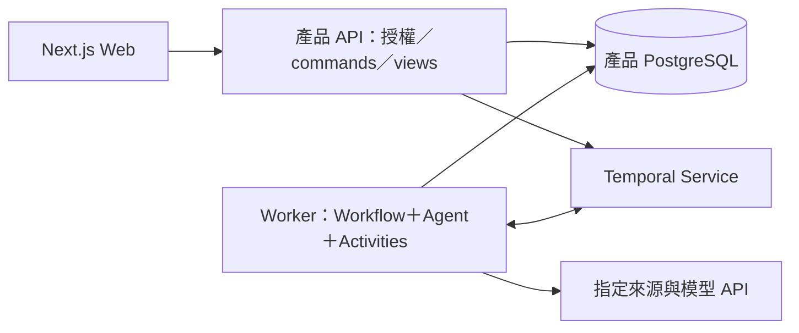

# Whisky Discovery Agent 技術架構

更新：2026-09-28。**已確定採 PydanticAI＋Python 後端＋Temporal**：使用者先選第三條執行路線，再確認 PydanticAI。Temporal 管理研究任務生命週期；部署、身分及其他配套仍是建議，尚未建立應用。產品行為見 [PRODUCT_SPEC.md](PRODUCT_SPEC.md)，本文件負責決策、邊界及驗證，不另存進度。

## 已確定與待選項

| 項目 | 狀態 |
|---|---|
| Agent framework＋持久化 workflow | 第一版需求；已選 Temporal 路線。 |
| 執行權威 | Temporal 管工作派送、等待、重試及恢復；Agent framework 管模型與工具協調。 |
| 產品範圍 | 個人探索計畫、可交辦研究，沿用雙入口、六項基礎能力、小型 reviewed catalog、台灣參考價格及可靠記憶。 |
| Agent framework | 已選 PydanticAI＋Python 後端，使用官方 Temporal 整合；Mastra TypeScript 留作替代紀錄。 |
| Web／產品保存 | 建議 Next.js＋TypeScript、帳號＋PostgreSQL；身分、ORM 及部署須配合框架確認。 |
| 既有技術 | ADK、AG-UI、LangGraph、Agent Server 及全 TypeScript 都不是限制；舊版只有文件，沒有應用歷史要相容遷移。 |
| 後續功能 | 定期追蹤、通知及自動發布仍未納入 MVP。 |

## 執行路線的決策

| 選項 | 收益與代價 | 本輪處理 |
|---|---|---|
| LangGraph＋原生 Agent Server | 同一體系整合 graph、queue、checkpoint 與串流，整合邊界少；執行依賴該 runtime。 | 前版建議；使用者本輪選擇第三條，改為歷史替代方案。 |
| **Agent framework＋Temporal** | Agent 推理與通用持久工作分工；需維護 worker、產品 API 整合及 replay 相容性。 | **已選定**。Temporal 是唯一工作生命週期管理者。 |
| Library＋checkpointer，自行補 runtime | 部署控制力高；還要處理派送、worker 與恢復機制。 | 不選，不自建通用 runner／queue／checkpoint 平台。 |

原生 runtime 的整合優勢仍成立，選 Temporal 不代表前者無法做到。本輪依使用者明確選擇建立獨立執行層；沒有跨系統長交易不是排除 Temporal 的理由。也不代填使用者未說的學習或商業動機。

基準能力見 [Agent Server](https://docs.langchain.com/langsmith/agent-server)；Temporal 的執行程序見 [Workers](https://docs.temporal.io/develop/python/workers)。選 Temporal 不等於已選 Temporal Cloud，亦不代表 Cloud 會替產品部署自己的 worker。

## Temporal 路線中的 Agent framework

| 選項 | 整合方式與取捨 | 建議 |
|---|---|---|
| **PydanticAI＋Temporal** | 官方把 Agent 協調放在 workflow，模型／工具 I/O 放在 activities；代價是 Python 後端與 TypeScript Web 的契約及工具鏈。 | **已選定**，符合逐次模型／工具呼叫的恢復需求。 |
| Mastra＋Temporal | 官方將 workflow／step 映射為 Temporal workflow／activity；能維持全 TypeScript。 | 若語言統一優先則選；需驗證 step 內 Agent I/O、等待與取消的實際恢復粒度。 |
| LangGraph＋Temporal | 可使用圖建模，但必須明確安排 replay、等待及重試的權威，避免兩套狀態機各自恢復同一任務。 | 沒有必須沿用既有 graph 的限制，目前不優先。 |

[PydanticAI 官方整合](https://pydantic.dev/docs/ai/capabilities/durable_execution/temporal/) 現用 `TemporalDurability`；舊 `TemporalAgent` wrapper 已 deprecated。能力必須在 Temporal workflow 中執行才具持久性，直接從 HTTP endpoint 呼叫 agent 仍是普通執行。

[Mastra 官方整合](https://mastra.ai/integrations/deploy/temporal) 證實 step 對應 activity；不能據此推論 step 內每次模型／工具呼叫都已有獨立恢復點，也不能把文件沒有展示的功能判為不支援。框架比較是本案工程判斷，不是普及率排名。

## 建議配套與專案結構

以下是 **已選 PydanticAI 路線的配套草案**。Python 後端已確定，Next.js、FastAPI、DB 工具與身分實作尚待具體核定，未將框架選擇解讀成已接受全部套件。

| 層 | 建議 | 責任 |
|---|---|---|
| Web | Next.js＋React＋TypeScript | 探索畫面、帳號互動與薄 BFF；不執行長研究。 |
| 產品 API | FastAPI＋Pydantic | 授權、commands、查詢、公開 view；提供 OpenAPI 契約。 |
| Agent／Worker | PydanticAI＋Temporal Python SDK | workflow 協調、Agent、activities；與 API 共用 Python domain/use cases。 |
| 產品 DB | PostgreSQL＋SQLAlchemy／Alembic | 應用 schema 與 migrations；由 Python 後端擁有，不同時讓 Drizzle 管同一批表。 |
| 身分 | Google 登入方向保留，Auth provider 待核定 | API 驗受信任身分及 owner；不能相信 browser 自填 user ID。先核定跨 Web／API 的驗證契約，不自製密碼或 token 系統。 |
| 契約 | 後端 Pydantic／OpenAPI 為來源，產生 Web client/types | Python 與 TypeScript 不手寫兩份業務規則；產生器在骨架固定，CI 檢查差異。 |
| 驗證 | pytest、Temporal test environment／replay、真 PostgreSQL、Playwright、固定 eval | 分開驗 domain、持久工作、產品資料及使用者旅程。 |
| 部署 | Web、API、worker 分開程序；Temporal service 與產品 DB 分開責任 | API／worker 可由同一後端映像啟動不同 entrypoint；不按品牌、價格或會員再拆微服務。 |

配套文件：[FastAPI](https://fastapi.tiangolo.com/features/)、[SQLAlchemy](https://docs.sqlalchemy.org/en/20/intro.html)、[Alembic](https://alembic.sqlalchemy.org/en/latest/)。產品 domain 由 Python 後端擁有，Web 使用公開契約；未來若改 Agent framework 須另行重評，不並存兩套 domain。



```text
apps/web/                 # Next.js
backend/
  src/
    api/                  # HTTP、auth adapter、commands、views
    workflows/            # deterministic orchestration、Update／Query
    agents/               # PydanticAI agent、prompts、typed output
    activities/           # I/O 與 framework integration
    domain/               # catalog／discovery／plans／memory use cases
    adapters/             # DB、來源、身分、Temporal client
  migrations/             # 單一產品 schema migration authority
  tests/                  # unit、integration、replay、recovery、evals
contracts/                # generated OpenAPI／Web client，非第二份手寫 SSOT
data/catalog/             # 人工覆核的來源資料與發布版本
tests/e2e/                # Web 旅程
```

Domain 不 import FastAPI、PydanticAI、Temporal 或 ORM；活動與 API 都呼叫同一批 use cases。自然語言與點選採相同 command 語意。runtime／依賴的相容版本在骨架鎖定，現在不提供不存在的執行命令。

## 資料與執行權威

| 狀態 | 權威來源 | 邊界 |
|---|---|---|
| 帳號、偏好、收藏、探索計畫、證據及報告 | 產品 PostgreSQL | 可匯出及刪除；模型上下文按需組成。 |
| 執行位置、等待、timer、activity 結果與重試 | Temporal Event History | 由 SDK 重播恢復；不是偏好或報告的長期資料庫。 |
| 畫面及進度 | API view／帶時間的投影 | 重連重新查任務及結果；token stream 不是唯一結果。 |

計畫有 `planId` 與研究條件 revision；更改目標／偏好／限制才推進，新增進度不使自己的研究失效。每個研究 `taskId` 對應穩定 `workflowId`，另記 runtime `runId` 供診斷；身分與授權不能依賴 ID 保密。

一次探索計畫可包含多個有界研究 workflow，不建立永不結束的使用者 workflow。每次工作限制工具次數、模型用量、history 大小及執行期限，另設帳號與整體並行／用量上限；等待回覆的期限與 activity timeout 分開。

## Temporal 執行契約

### 接受、去重與資料庫邊界

1. API 從受信任登入取得 actor，驗 owner、條件 revision 及允許的 command；client 不可選任意 workflow type、queue 或 tool config。
2. 產品 DB 以 command key＋payload hash 去重，建立唯一 task 及 workflow ID；同 key 不同 payload 拒絕。API 按同一 ID start，明確設定正在執行與已完成 ID 的衝突／重用政策；新研究才產生新 task。
3. Temporal service 確認接受，或同 ID 查回已存在，才顯示工作已接受。API 回應遺失時對帳既有 ID；不可為一次 HTTP retry 建立第二份工作。workflow 已完成則回傳原結果。
4. 產品 DB 寫入與 Temporal start 不是分散式交易。未確認接受保持待確認，重送或對帳沿用原 task；不使用「DB 有一列」冒充已入列，也不另寫通用 scheduler。
5. 完成報告的 DB transaction 驗 owner、task generation、研究條件 revision 及取消／被取代資格；以 artifact key 去重。DB 已 commit 但 activity completion 未記錄時，重試返回既有 artifact。

### Workflow 與 activities

Workflow 只做可重播的協調。模型、來源 HTTP、DB、檔案及其他 I/O 由 activities 執行；使用 framework 的官方整合，不把整個長研究 Agent loop 塞進單一 activity，也不另寫通用模型工具迴圈。

PydanticAI 的 `TemporalDurability` 負責其模型及工具 activities；產品 DB、來源與報告仍走明確 use cases。不能將其 durable agent 再包進外層普通 activity，丟失預期的呼叫粒度。

已記錄的 activity 結果可供 replay；尚未記錄 completion 的外部呼叫可能再執行。資料寫入使用業務唯一鍵與交易，不承諾所有 I/O exactly-once。設定 activity timeout、有限 retries、不可重試錯誤及整體研究預算，避免 SDK retries 與 Temporal retries 相乘。

### 人為等待與補充

Agent 回傳 typed 的「需要補充」結果後，workflow 保存 `clarificationId`、等待版本、問題與已完成研究引用，透過 durable wait 等待。問題呈現後不保持一個等待數天的 activity，也不持續呼叫模型。

補充採 Temporal **Update**：API 先驗 owner，command 帶 clarification ID、等待版本、條件 revision、idempotency key；workflow validator／handler 驗狀態，接受後保存答覆並解除等待。重送使用相同 Update ID／command，取回相同接受結果；舊答覆不可套到下一個問題。若所選 SDK 的去重範圍不足，須以 workflow 內 command receipt 補上業務去重，不能假定跨 run 自動保證。

Update 的答覆只表示補充已處理，不等於研究完成。短 HTTP timeout 後顯示待確認並對帳，不重新提問。Query 僅供讀取公開狀態；worker 不可用時可能無法服務 Query，API 應回可辨識的暫不可用或帶時間的投影。Signal 適合不需要即時業務回覆的控制訊息，server 接受 Signal 不代表 workflow 已處理。[訊息語意](https://docs.temporal.io/develop/python/workflows/message-passing)

補充後以新的 activity 重新讀目前 catalog／價格資格，保存前再驗當下條件；不能把等待前已記錄、replay 取回的舊查詢結果當成新查核。研究證據仍可留作歷史。

### 取消、條件變更與版本

取消／刪除先在產品 DB 撤銷寫入資格，再要求 Temporal 取消。外部 activity 可能來不及停止，晚到結果仍須被 transaction 擋下；取消是協作式，不能只憑 API 已送出宣稱外部 I/O 已停止。

計畫研究條件變更時，交易推進 revision、標舊未完成 task「已被取代」並關閉寫入，再通知 workflow 停止及關閉待補問題；完成報告保留為歷史。使用者選擇依新條件研究才另建 task，不暗中改寫原 workflow 輸入。

workflow／activity／tool 名稱、payload schema、model／prompt／policy／catalog 版本均可追溯。部署要跑舊 history 的 replay；不相容變更用版本化 worker 或 SDK patching，等待中的舊工作有明確可用 executor。具體 Worker Versioning 設定在骨架驗證，不能只測新 workflow。[安全部署](https://docs.temporal.io/develop/safe-deployments)

## 研究、UI 與資料治理

Agent 只能查 reviewed 庫、讀指定來源、比對版本、提出問題及整理引用；不能自行放寬硬限制、改已確認偏好或發布正式 catalog。外部頁面是資料，reader 限允許的 HTTPS 來源、redirect、大小／時間及網路目的地，阻擋私有網路及任意 URL。

研究觀察、模型整理、證據與覆核狀態分開保存；待覆核資訊可明示於報告，正式推薦／嚴格預算只使用 reviewed 資料。catalog 由 Git 中覆核資料發布為不可變版本；用戶補充不等於編輯者覆核。

Web 經產品 API 讀任務 snapshot，顯示等待執行／研究中／需要補充／完成／失敗／已取消／已被取代。第一個骨架以狀態查詢證明完整流程；即時串流再依所選 framework 官方 durable backend 整合驗證。AG-UI 或 AI SDK UI 不擁有工作生命週期，不能為了串流直接從 HTTP 執行普通 agent。

Browser 不持有 Temporal／模型憑證，也不能直接 Query 任意 workflow。內部 history、工具原文及隱藏推理不公開，卡片 facts 驗證並保存後才顯示。進度通知可以重送或缺漏，公開結果以產品 DB 為準。

刪除涵蓋產品 DB、相關 Temporal 執行歷史／payload、traces 與備份保留政策；使用最小必要 payload，不把秘密或不必要的完整個資放進 history。匯出不能替代備份；產品 DB 的 PITR／RPO／RTO 目標與 Temporal service 的 retention／恢復條件分開驗證。

Logs 記 task／workflow／run／revision、階段、latency、用量與錯誤分類；模型輸入輸出預設遮罩或不記。執行所需 history 與可選 debug traces 分開治理，兩者的保留／刪除均需驗證。

## 第一個交付與驗收出口

第一個垂直流程是「委託研究 → 真實來源 → 等待補充 → 關頁 → 登入回覆 → 繼續研究 → 保存報告」。以隔離 fixtures 控制故障，實際模型／來源連接與 stub 分開記錄。

| 驗證 | 通過條件 |
|---|---|
| 產品規則 | 版本、硬限制、價格時效、未知值、引用及 reviewed 邊界正確。 |
| 接受與重送 | start 回應遺失後沿用原 workflow；完成的 task 不被 HTTP retry 重啟。 |
| 正常等待 | 換程序與瀏覽器仍可找到同一問題並接續；重送答覆不再注入，舊答覆不能進下一個等待。 |
| Worker crash | 執行中非正常中止後由新的 worker 恢復；已記錄工具結果不重做，未確認完成的 I/O 可重試但寫入不重複。 |
| DB／Temporal 邊界 | DB commit 後 activity completion 前中斷，恢復不產生第二份報告；取消、刪除及條件改版擋晚到結果。 |
| 部署相容 | 舊版本等待中的 history 可在受控版本恢復，replay tests 有辨別力。 |
| 身分與跨語言契約 | 不同帳號不可讀／回覆；Web client 符合實際 API schema，模型不能擴張授權範圍。 |
| 營運 | worker、Temporal service、產品 DB 各自故障可診斷；恢復、刪除與費用有實測紀錄。 |

模型使用同一組繁中需求理解、版本消歧、工具選擇、來源衝突及修改案例比較品質／延遲／成本。框架鎖版、身分驗證、部署方案與模型是下一步具體選型，不能以只裝套件或模型回一句話宣告架構成立。交付相依見 [PRODUCT_SPEC](PRODUCT_SPEC.md#開發順序與完成界線)。
