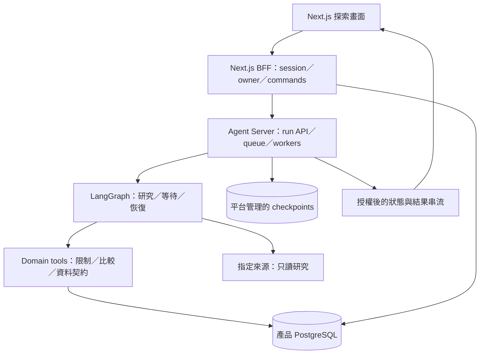
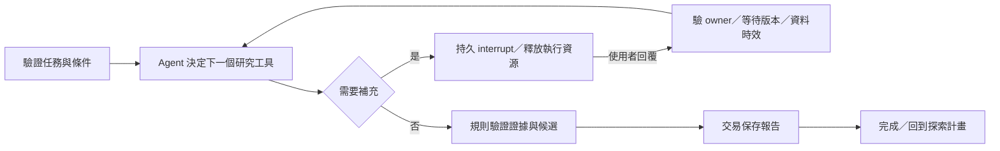

# Whisky Discovery Agent 技術架構提案

更新：2026-09-28。狀態：使用者已要求第一版使用 Agent framework 與持久化 workflow，並同意以個人探索計畫、可交辦研究任務繼續選型。**本文是更新後的技術建議，尚未核定具體供應商、開通服務或實作。** 產品行為見 [PRODUCT_SPEC.md](PRODUCT_SPEC.md)，本文件負責選型、責任與驗證，不另存進度。

## 建議結論與前提

建議 **Next.js＋TypeScript、LangGraph TypeScript＋LangSmith Deployment（Agent Server）、PostgreSQL**。單一產品與 repository，共用 domain modules；Web 與 Agent runtime 分開部署。LangGraph 建模研究步驟、工具選擇及人機交接，Agent Server 提供持久化與背景執行；產品資料由自己的 PostgreSQL 保存。

這取代先前「AI SDK 控制單次流程、HTTP 中斷後重做」的提案。新的需求已包含跨時間等待和工作恢復，不能只把原流程加上聊天紀錄就稱為 durable workflow。可靠性仍須以實際重啟、重送與跨版本恢復驗證，套件名稱不能代替證據。

| 前提 | 本輪判斷 |
|---|---|
| 新手／熟手、六項基礎能力、真實小型 catalog、台灣價格 | 保留，成為探索計畫中的操作能力。 |
| Agent framework＋持久化 workflow | 使用者明確要求；現在是設計前提。 |
| 個人探索計畫＋可交辦研究任務 | 本輪規劃主軸；等待補充、背景研究、跨重啟恢復納入驗收。 |
| 紀錄可靠、可長期使用 | 已確認優先序；帳號＋伺服器保存仍是具體建議。 |
| ADK、AG-UI、全 TypeScript、單一服務、特定雲 | 沒有強制限制；逐項重評，不能因前稿出現過就沿用。 |
| 定期追蹤、通知、資料庫自動發布 | 後續候選；沒有因採用 workflow engine 而一併納入 MVP。 |
| 上線相容性 | repo 仍是文件骨架；用 `git ls-files` 核對追蹤內容，無須維持既有應用 API。 |

## 執行架構的選擇

以下是官方能力查證後的本案判斷，不是以普及率排名：

| 路線 | 能力與代價 | 判斷 |
|---|---|---|
| LangGraph library＋PostgreSQL checkpointer | 可保存圖狀態、interrupt／resume；自行部署時還要處理背景派送、worker 生命週期及恢復觸發。 | 單靠這個組合不算本案完整執行方案；不自建通用 queue／runner 補齊。 |
| **LangGraph＋LangSmith Deployment Agent Server** | 同一體系提供圖、持久狀態、run API、背景佇列與串流；代價是平台費用、供應商依賴及 checkpoint 與版本管理。 | **建議**。本案核心是研究 Agent 的分支、等待與恢復，原生 runtime 可完整承接。 |
| Agent framework＋Temporal | 可持久處理跨時間工作、訊息及活動重試；需維護 worker、workflow 相容性與另一個執行系統。 | 當明確要獨立的通用 workflow 平台時選。若選此路，讓 Temporal 擁有整體工作生命週期。 |
| Mastra＋Temporal／Inngest | TypeScript Agent 與 workflow 有官方 durable engine 整合；各種 adapter 的恢復粒度與功能必須實測。 | 合理替代。不能把一個 workflow step 的 checkpoint 推論成該 step 內每個 model／tool call 都不會重跑。 |
| PydanticAI＋Temporal | Python 型別及 Agent 能力，官方整合會將模型／工具 I/O 放進 Temporal activities。 | 若選 Temporal，我偏向優先驗證這個原生整合；代價是 Python backend、跨語言契約與工具鏈。 |

官方 [Agent Server](https://docs.langchain.com/langsmith/agent-server) 明列 persistence、task queue 與背景執行；[LangGraph persistence](https://docs.langchain.com/oss/javascript/langgraph/persistence) 說明 checkpointer 和跨 thread store 的區別。[Temporal timers](https://docs.temporal.io/develop/typescript/workflows/timers) 與 [訊息機制](https://docs.temporal.io/develop/typescript/workflows/message-passing) 支援長時間等待及外部事件；這些能力沒有要求本案同時放兩個任務管理者。

替代方案依 [Mastra Temporal 部署文件](https://mastra.ai/integrations/deploy/temporal)、[Mastra durable agents](https://mastra.ai/blog/introducing-durable-agents) 與 [PydanticAI Temporal 整合](https://pydantic.dev/docs/ai/capabilities/durable_execution/temporal/) 查證。PydanticAI 現行文件推薦 `TemporalDurability`，舊 `TemporalAgent` wrapper 已標 deprecated；若採用需依當時版本驗證，不能照舊範例起手。

### 為什麼目前建議 LangGraph 原生 runtime

研究任務需要在「查庫、查來源、版本消歧、等待補充、比較、產出報告」間動態選擇，而 domain 同時要控制價格與證據規則。LangGraph 適合將確定性節點與有界 Agent 子圖組合；使用 LangChain 的標準 agent／tool primitives，不另寫通用模型工具迴圈。[官方 workflows／agents 指引](https://docs.langchain.com/oss/javascript/langgraph/workflows-agents)

原生 Agent Server 承接 run 的派送、checkpoint 與串流，可以少維護一組跨框架執行邊界。**LangGraph＋Temporal 並非不可行**，但本案還沒有跨多個非 Agent 系統的長交易需求，兩者共同掌握相同等待／重試容易產生重疊責任。

託管 runtime 是明示的選型代價。2026-09-28 的 [Cloud 部署指引](https://docs.langchain.com/langsmith/deploy-to-cloud) 列 Plus 以上為前提；[價格頁](https://www.langchain.com/pricing) 列 Plus US$39／seat／月，另須按實際方案核對部署、儲存、模型及產品 Web／DB 用量費用，不把席位費當總成本。目前沒有付費或登入操作。

自架 Agent Server 也不是把 OSS library 包成 Docker 就等價：官方 [standalone 指引](https://docs.langchain.com/langsmith/deploy-standalone-server) 列 PostgreSQL、Redis、license 等條件，並區分開發 Compose 與其生產部署建議。本案優先託管，不為展示作品自行營運 Kubernetes。若拒絕平台依賴，重新選擇完整替代路線，不留下「自行補一套 runtime」的隱藏工作。

## 完整 stack 與沿用理由

| 部分 | 從目前需求重新選擇 | 邊界與代價 |
|---|---|---|
| Web／BFF | Next.js App Router＋React＋TypeScript | 帳號、探索畫面與薄 API；長任務移出 HTTP request。Vite＋Hono 同樣可行，Next 的優點是整合 Web 約定。 |
| Agent／workflow | LangGraph TypeScript，Agent Server 託管執行 | research graph＋明確 domain tools；不再以 AI SDK Core 當第二個 Agent 執行核心。 |
| UI 傳輸 | Agent Server 官方 SDK／stream API，經 BFF 授權 | 不加 AI SDK UI 或 AG-UI 轉譯層。前端只看允許公開的進度與已驗證結果。 |
| 產品 DB | 託管 PostgreSQL＋Drizzle SQL migrations | 身分、偏好、計畫、證據與歷史；獨立於 runtime 內部資料表，不直接操作其 checkpoint schema。 |
| 身分 | Better Auth＋Google OAuth | server session 轉為 app actor；身分資料在產品 DB，維護套件與設定由應用負責。 |
| Runtime／工具 | Node.js 24 LTS、TypeScript strict、pnpm workspace | 同語言共用 domain／契約；Web 與 Agent 是真實部署邊界，因此這次有拆 workspace 的理由。先不加 Turborepo 等工具。 |
| 資料取得 | 指定來源 registry＋受限 HTTP reader | Agent 可選來源與補查順序；第一版不開任意瀏覽器操作或任意 URL 工具，搜尋 provider 待實際覆蓋缺口才選。 |
| 驗證／觀測 | Vitest、PostgreSQL integration、Playwright、固定 eval 語料；runtime trace＋應用 logs | 觀測工具不成為偏好或歷史的權威來源；對話內容設定刪除與遮罩政策。 |

保留 TypeScript 是因 Web、graph、domain 與 schema 可共用且沒有 Python 特有需求；不是沿用原 ADK 的語言限制。Next.js 可 [自行部署到 Node／Docker](https://nextjs.org/docs/app/guides/self-hosting)。身分與 migrations 分別依 [Better Auth Next.js](https://better-auth.com/docs/integrations/next)、[Drizzle migrations](https://orm.drizzle.team/docs/migrations)；具體相容套件版本在第一個骨架鎖定。

模型先要求繁體中文、可靠 tool calling／結構化輸出及用量回報，以同一組版本消歧、來源衝突、追問、局部偏好修改案例比較品質、延遲與成本。先選一個通過門檻的模型，不建立多模型投票系統；換模型要重跑 eval。

## 部署與專案架構



這是單一產品的 Web／Agent 執行分工，沒有拆品牌、價格或使用者等微服務。平台自己的 PostgreSQL／Redis 不等於應用要再建一套 cache；產品 DB 與 runtime persistence 是兩個不同責任與生命週期。

```text
apps/
  web/                     # Next.js UI、Better Auth、薄 BFF
  agent/                   # LangGraph graphs、nodes、受限 tools、runtime 設定
packages/
  core/                    # catalog／discovery／plans／memory 的 domain 與 use cases
  contracts/               # Zod commands、views、研究與補充資料契約
  data/                    # 產品 DB schema、模組各自的 repositories、transactions
data/catalog/              # 已查核的編輯來源與發布資料
drizzle/                   # 可審閱的產品 DB migrations
tests/                     # integration、recovery、e2e、evals
```

Domain 不 import Next.js、LangGraph、ORM。Agent nodes 與 BFF 都呼叫相同 use cases；資料庫 adapter 不混入 prompt。各模組 owns 自己的查詢與修改，跨模組走明確介面，不為每個小函式建立抽象層。

## 三種狀態各有一個權威來源

| 狀態 | 權威來源 | 規則 |
|---|---|---|
| 使用者與產品資料 | 產品 PostgreSQL | 帳號、明確偏好、收藏、品飲回饋、探索計畫、來源證據與報告；可匯出及刪除。 |
| 執行位置與等待 | Agent Server／LangGraph checkpoints | thread、run、node 狀態、interrupt、工具進度；由 runtime 管理，不另做一套 competing runner。 |
| 瀏覽器呈現 | Server 資料的投影 | 草稿、選取項、串流進度可暫存；重連後重新取 authoritative task／result，不以 token stream 重建唯一結果。 |

計畫具有 `planId` 與研究條件 revision；更改目標、偏好或限制才推進此 revision，新增進度與報告不會使自己的任務失效。研究任務有獨立 `taskId`／thread，保存起始條件快照與 revision。一次探索計畫可產生多次研究任務，不能讓所有人的工作共用 thread，也不把終身偏好塞進無限增長的 graph state。

產品保存任務與 thread／run 的映射、取消 fence 及已完成 artifact；即時執行狀態從 runtime 取得，若有顯示快取需標示更新時間。Runtime Store 不另存一份可互相衝突的長期偏好；每次從產品 use case 取得需要的上下文。

## 研究與等待的執行契約



### 接受、派送與並行

1. BFF 從 session 取得 owner，驗證 plan／task 所屬；client 只能送允許的 command，不可指定有效身分、任意 graph、model 或工具設定。
2. command 帶 idempotency key、payload hash 與 expected revision。產品 DB 唯一約束處理同請求重送；不同 payload 使用同 key 時拒絕。
3. 建立 task 映射後呼叫 runtime 的背景 run API。**只有 runtime 確認入列，或查回同 command 已入列，才顯示工作已接受**。網路結果不明時顯示待確認，使用既有 task／thread 對帳，不盲目建立新任務。
4. 不假定 run API 支援任意 client 指定 run ID。啟動入口以 command key 對應唯一 logical task／thread；重送回傳原任務與接受紀錄，不另起昂貴工作。去重不能永久綁死某個 process／run ID，阻擋同一任務的正常恢復；SDK 原生去重及同 thread 並行控制須在骨架驗證。
5. 補充有獨立 command，綁定 task、interrupt ID、等待版本與條件 revision；在實際中斷恢復入口原子選定並保存唯一答覆。同 command 重送回傳原接受紀錄，不再次注入補充；checkpoint 重播可重讀已保存答覆，繼續尚未完成的步驟，不能將「答覆已接受」誤作整段工作已完成。舊答覆不得送入下一個 interrupt；不能只靠第一個 graph 節點去重。
6. 計畫研究條件變更時，交易內推進 revision，將舊條件的未完成任務標為「已被取代」並撤銷寫入資格，再要求 runtime 停止；舊待補問題關閉。已完成報告保留為歷史。使用者選「依新條件研究」才另建關聯新 task，不暗中改寫舊任務或自動增加研究。獨立 task 可並行，但有帳號及整體並行／用量上限。

[背景 run API](https://docs.langchain.com/langsmith/agent-server-api/thread-runs/create-background-run) 提供非同步執行與 durability 選項。API 入列與產品 DB 不是分散式原子交易，因此接受語意、對帳與業務去重不能省略；這是應用整合責任，不是自建 Agent engine。

### Agent 的權限與研究資料

Agent 可選查庫、讀指定來源、比對版本、提出補充問題、整理帶引用的草稿。它不能自行放寬預算、捏造未知值、寫入已確認偏好或發布正式 catalog。

Tool schema 只接收白名單欄位；server 取得 owner 與資源範圍。來源頁面視為資料，不作指令；HTTP reader 限定允許的 HTTPS 來源、重導向、回應大小及時間，阻擋私有網路目的地。不要把 user 任意 URL 直接交給具內網權限的 worker。

查到的原始觀察、整理後主張、證據與覆核狀態分開保存。研究報告可展示標明「待覆核」的新資訊；正式推薦卡、嚴格預算與 catalog 更新仍只使用 reviewed 資料。使用者補充瓶身資料不是編輯者的來源覆核。

### Checkpoint、重試與人機交接

- 重要研究 runs 建議 `durability: sync`，在下一步前完成 checkpoint 寫入；接受其延遲代價。Agent Server 自動注入 persistence，graph 不再自行配置另一個 checkpointer。[API 契約](https://docs.langchain.com/langsmith/agent-server-api/thread-runs/create-background-run)
- 一個 node 保持有界且可恢復；已取得的來源證據以 artifact ID 引用，不在單個巨大 node 內執行整份長研究。未完成或 checkpoint 前的工作可能重跑，不承諾所有外部呼叫 exactly-once。
- 短暫網路／限流錯誤有界重試，輸入錯誤、權限拒絕與來源衝突有不同出口。LangGraph 的 node retries 要明確配置；各層 retry 次數與時間合計有總預算，不將 SDK 重試和 workflow 重試無限相乘。[Fault tolerance](https://docs.langchain.com/oss/javascript/langgraph/fault-tolerance)
- interrupt 持久化待補問題、版本及狀態，等待期間沒有持續模型呼叫。恢復時重新驗 owner、interrupt ID、revision 與價格時效；條件未變才接續，已被取代則回傳終態與新條件研究入口。等待期限與 active execution timeout 分開。
- 恢復會重新進入中斷 node；前置 side effects 必須拆到已完成節點或具冪等鍵，不能重送收藏、修改偏好或發布資料。[Interrupts](https://docs.langchain.com/oss/javascript/langgraph/interrupts)
- 取消先在產品 DB 撤銷 task 的寫入資格，再請 runtime 取消。即使外部呼叫來不及停止，結果交易也不能繞過 fence。完成報告同時驗 owner 存在、task generation、plan revision 與取消狀態。
- DB commit 成功後才公開完成報告。若 DB 已寫入而 checkpoint 尚未保存就中斷，重跑以同 artifact key 取得既有結果；不能新增第二份或再套一次「預算加 200」。

## UI、存取與記憶

使用者看見「等待執行／研究中／需要補充／完成／失敗／已取消／已被取代」，以及可補充、取消、重新研究的入口。重送失敗的 HTTP 要求沿用原 command；新的研究要求另建任務，兩者明確分開。

串流走官方 run／stream API，BFF 逐項驗 owner；API key 只在 server。禁止建立讓 browser 任意代理 runtime 路徑的通用 proxy。原始 checkpoints、model messages、內部 tool output 和隱藏推理不直接公開；只提供公開進度和驗證後的 view model。斷線重連先讀 task snapshot，再接續可用串流；未收到的進度動畫不影響已保存結果。

登入、匯出、刪除與私有 cache 邊界維持產品要求。刪除先取消工作及關閉寫入，再刪產品資料、runtime threads／checkpoints 和相關 trace；保留政策與備份還原流程也需涵蓋這些儲存處。清除產品 DB 不等於整個 Agent 的資料已刪除。

catalog 仍由 Git 中人工覆核的資料發布成不可變版本，產品 DB 提供正式讀取。研究 evidence 與正式 catalog 分開；只有編輯者覆核後才進發布流程。歷史報告保留當時依據，新探索重新檢查目前版本和價格；不把歷史結論當新推薦。

## 驗證與上線出口

| 層次 | 必須提供的證據 |
|---|---|
| Domain／catalog | 價格資格、版本、未知值、證據引用及限制測試；正式資料與 synthetic fixtures 隔離。 |
| DB integration | owner 隔離、唯一性、revision、取消 fence、artifact 去重，以及 commit 成功／checkpoint 失敗的重放。 |
| Agent 行為 | 固定繁中語料驗工具選擇、何時追問、來源衝突與證據解釋；模型失敗保持可用出口。 |
| Runtime 恢復 | 正常 interrupt 後換程序恢復；執行中 worker 非正常停止後自動恢復；兩者是不同測試，不能互相代替。 |
| 任務整合 | 入列回應遺失、補充已接受但回應遺失後重送、接受答覆後 checkpoint 前中止、舊答覆誤送下一個 interrupt；等待期間修改條件使舊任務被取代，新任務另建；刪除／取消與晚到結果。 |
| UI／E2E | 關頁後背景任務仍完成，另一瀏覽器登入可找到任務與待補問題；跨帳號不可讀／resume。 |
| Deployment 版本 | 舊版本建立的等待任務在新版本可正確恢復；不相容時先保留舊 executor 或受控遷移，不能只測新任務。 |
| 營運與刪除 | 產品備份還原、runtime retention／恢復方式、刪除傳播與費用觀測都可驗證。 |

所有 node／tool 名稱、state schema、prompt／model／policy／catalog 版本要可追溯。長期等待的 checkpoint schema 是需要相容性的正式資料；graph 升級不能隨意刪 rename node 後直接部署。

本機 `MemorySaver`、開發 server 或 stub 通過，只證明其涵蓋的行為。正式 runtime 恢復在 staging 做中斷演練；若託管環境無法直接注入 worker crash，需使用供應商支援的測試方式取得等價證據，不能以重新整理瀏覽器冒充服務恢復。

Logs 記 task／run／revision、階段、latency、tokens、錯誤分類；輸入輸出預設遮罩或不記。LangSmith trace 的內容與保留期要明確設定，不因使用部署平台就上傳不必要的完整對話。Runtime checkpoint 為執行所需資料，與可選 debug traces 分別治理。

產品 DB 建議維持自動備份＋PITR，初始 RPO ≤15 分鐘、RTO ≤4 小時為待成本與演練支持的目標，非已承諾 SLA；runtime 狀態有另一套服務保留／恢復條件，不能把產品 DB 的目標直接套給平台。Web、runtime 與 DB 的區域、延遲及總費用在部署前一起核對。

## 第一個技術驗證與後續選型

第一個交付是一段完整的「委託研究 → 查一個真實來源 → 等待補充 → 關頁／中斷 → 恢復 → 驗證條件 → 保存報告」。用隔離 fixture 控制故障，同時保留真實資料路徑；模型／來源 stub 與真實連接的驗收分開記錄。

先通過持久化、背景入列、補充恢復、重送／取消、資料寫入與部署相容性，再擴展雙入口 UI 和酒款覆蓋。詳 [PRODUCT_SPEC 的交付相依](PRODUCT_SPEC.md#開發順序與完成界線)。

尚待實測的是相容套件版本、模型選擇及託管方案的成本／恢復條件。若原生 runtime 無法通過上述核心恢復驗收，回到完整的 Temporal 路線比較，不在既有方案旁再自建 lease／scheduler／checkpoint 系統補洞。定期追蹤、通知與資料自動發布仍是後續產品決策。
