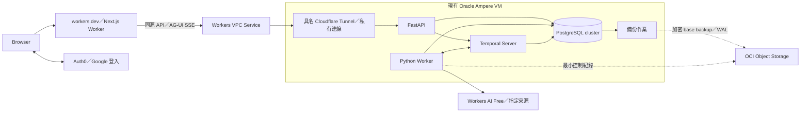

# Whisky Discovery Agent 技術架構

更新：2026-09-28。第一版採 **Cloudflare Workers 上的 Next.js、AG-UI、PydanticAI＋Python 後端與 Temporal**；無自有網域時以 `workers.dev`、Auth0 Free 與 Workers VPC Service 連接既有 Oracle VM 作為實作基準。Oracle Ampere ARM VM 以 4 CPU／24 GB、目前帳單 US$0 為基準；免費資格須按 PAYG／Free Tier 類型及總用量分別核對。Cloudflare 優先 Free，最多考慮 Workers Paid 的 US$5 基本費，不新增其他持續付費服務。入口、額度與還原仍須實測；目前實作證據見 IMPLEMENTATION_PLAN。產品行為見 [PRODUCT_SPEC.md](PRODUCT_SPEC.md)，本文件負責決策、邊界及驗證，不另存進度。

## 已確定與待選項

| 項目 | 狀態 |
|---|---|
| Agent framework＋持久化 workflow | 第一版需求；已選 Temporal 路線。 |
| 執行權威 | Temporal 管工作派送、等待、重試及恢復；Agent framework 管模型與工具協調。 |
| 產品範圍 | 個人探索計畫、可交辦研究，沿用雙入口、六項基礎能力、小型 reviewed catalog、台灣參考價格及可靠記憶。 |
| Agent framework | 已選 PydanticAI＋Python 後端，使用官方 Temporal 整合；Mastra TypeScript 留作替代紀錄。 |
| Web／互動協定 | Next.js 部署在 Cloudflare Workers；AG-UI 是 Agent 互動的前後端協定。vinext 優先驗證，仍需實測。 |
| 身分與入口 | 無自有網域；訪客可看公開 catalog，私人探索使用 Auth0 Free 登入；Web 先用 `workers.dev`。 |
| API／產品保存 | FastAPI、PostgreSQL＋SQLAlchemy／psycopg／Alembic 為第一版實作基準；與 Temporal、備份的容量和恢復仍待實測。 |
| 託管與預算 | 現有 Oracle VM 帳單 US$0；A1 的 PAYG 與 Free Tier 公開免費時數不同，按實際帳戶與總用量核對，不把現況當未來保證。Cloudflare Free 優先，Workers Paid US$5 基本費不是用量硬上限。 |
| 既有技術 | ADK、LangGraph、Agent Server 及全 TypeScript 都不是限制；舊版只有文件，沒有應用歷史要相容遷移。 |
| 後續功能 | 定期追蹤、通知及自動發布仍未納入 MVP。 |

## 執行路線的決策

| 選項 | 收益與代價 | 本輪處理 |
|---|---|---|
| LangGraph＋原生 Agent Server | 同一體系整合 graph、queue、checkpoint 與串流，整合邊界少；執行依賴該 runtime。 | 前版建議；使用者本輪選擇第三條，改為歷史替代方案。 |
| **Agent framework＋Temporal** | Agent 推理與通用持久工作分工；需維護 worker、產品 API 整合及 replay 相容性。 | **已選定**。Temporal 是唯一工作生命週期管理者。 |
| Library＋checkpointer，自行補 runtime | 部署控制力高；還要處理派送、worker 與恢復機制。 | 不選，不自建通用 runner／queue／checkpoint 平台。 |

原生 runtime 的整合優勢仍成立，選 Temporal 不代表前者無法做到。本輪依使用者明確選擇建立獨立執行層；沒有跨系統長交易不是排除 Temporal 的理由。也不代填使用者未說的學習或商業動機。

基準能力見 [Agent Server](https://docs.langchain.com/langsmith/agent-server)；Temporal 的執行程序見 [Workers](https://docs.temporal.io/develop/python/workers)。選 Temporal 不等於已選 Temporal Cloud，亦不代表 Cloud 會替產品部署自己的 worker。

## Temporal 路線中的 Agent framework

| 選項 | 整合方式與取捨 | 建議 |
|---|---|---|
| **PydanticAI＋Temporal** | 官方把 Agent 協調放在 workflow，模型／工具 I/O 放在 activities；代價是 Python 後端與 TypeScript Web 的契約及工具鏈。 | **已選定**，符合逐次模型／工具呼叫的恢復需求。 |
| Mastra＋Temporal | 官方將 workflow／step 映射為 Temporal workflow／activity；能維持全 TypeScript。 | 若語言統一優先則選；需驗證 step 內 Agent I/O、等待與取消的實際恢復粒度。 |
| LangGraph＋Temporal | 可使用圖建模，但必須明確安排 replay、等待及重試的權威，避免兩套狀態機各自恢復同一任務。 | 沒有必須沿用既有 graph 的限制，目前不優先。 |

[PydanticAI 官方整合](https://pydantic.dev/docs/ai/capabilities/durable_execution/temporal/) 現用 `TemporalDurability`；舊 `TemporalAgent` wrapper 已 deprecated。能力必須在 Temporal workflow 中執行才具持久性，直接從 HTTP endpoint 呼叫 agent 仍是普通執行。

[Mastra 官方整合](https://mastra.ai/integrations/deploy/temporal) 證實 step 對應 activity；不能據此推論 step 內每次模型／工具呼叫都已有獨立恢復點，也不能把文件沒有展示的功能判為不支援。框架比較是本案工程判斷，不是普及率排名。

## 配套選型的前提與替代

真實限制是已選 Cloudflare Workers 上的 Next.js、AG-UI、Python Agent 後端、Temporal、可跨裝置找回探索紀錄、小型人工覆核 catalog、個人維護、無自有網域，以及沿用現有 Oracle VM／Cloudflare、持續費用 US$0 優先且最多考慮 Cloudflare Workers Paid US$5 基本費。TypeScript 全棧、每頁 SSR、Render、Temporal Cloud、既有資料遷移、微服務與本機保存都不是限制。這是選型與預算邊界，不是開通服務的授權。

| 可行組合 | 收益與代價 | 本案處理 |
|---|---|---|
| **Oracle VM 自架服務＋Cloudflare Workers Next.js** | 符合既有 VM 與指定 Web 平台；代價是單機資料／workflow 維運，以及 Workers 執行額度與 adapter 相容性要實測。 | **已選部署邊界**；先量測 VM 容量與 Workers 真實執行。 |
| 全部放 Cloudflare Workers／D1／Workflows | 邊緣託管減少 VM 操作，但會改寫 Python／Temporal 的執行權威與長時間工作契約；Workers Paid 另有用量超額。 | 不為部署平台推翻已確定的框架與 workflow。 |
| Render／託管 PostgreSQL＋Temporal Cloud | 維運與恢復工具較完整，適合有月費預算；前版試算固定計算即 US$59.50／月，另有 Temporal 用量與模型費。 | 歷史替代方案，已因新預算退出本輪首選。 |

這是依本案約束做的工程判斷，不是市場普及率排名。若取消費用限制，託管資料庫與 Temporal 會減少個人維運，但不改變產品 domain、API、workflow 與資料契約。單一 VM 不提供高可用性；可靠保存要靠 VM 外備份與演練，不能把「目前帳單 US$0」推論為服務等級保證。

Web framework 與平台已選 **Next.js on Cloudflare Workers**，本案仍採 Next.js Web＋Python API 的責任切分。Cloudflare 目前建議新專案用 vinext，OpenNext 為既有應用或 vinext 相容缺口的替代；vinext 仍是 beta，所以 adapter 尚不宣稱定案。建立骨架時在實際 workerd runtime 驗 App Router、登入候選、AG-UI/SSE、hydration、路由與 CPU 用量，再鎖定 vinext 或 OpenNext。靜態資產交由 Workers Assets；公開頁可預先產生，私有探索與報告以 FastAPI 的 owner 驗證結果為準，不因 Next.js 有 SSR／Route Handlers 就複製產品 domain 或另建資料權威。[Cloudflare Next.js Workers 指引](https://developers.cloudflare.com/workers/framework-guides/web-apps/nextjs/)、[OpenNext 替代路徑](https://developers.cloudflare.com/workers/framework-guides/web-apps/opennext/)。FastAPI 適合 typed API 與 PydanticAI 共用 Python 契約；Django 在內建後台、表單及 ORM 整合優先時更有吸引力，目前沒有這項優先順序。

## 建議配套與專案結構

以下是第一版**實作基準**，不是已驗證的部署。已選 Next.js／AG-UI／PydanticAI／Temporal；Auth0、VPC、資料庫與備份依無網域和費用限制收斂，骨架須通過相容、額度與還原驗證後才鎖定實際版本或宣稱可上線。

| 層 | 建議 | 責任 |
|---|---|---|
| Web | Next.js App Router＋TypeScript，部署在 Cloudflare Workers；vinext 為首個驗證候選 | 探索畫面、帳號互動與必要的邊緣頁面回應；不執行長研究或保存私人狀態。 |
| 產品 API | FastAPI＋Pydantic | 授權、commands、查詢、公開 view；提供 OpenAPI 契約。 |
| Agent／Worker | PydanticAI＋Temporal Python SDK | workflow 協調、Agent、activities；與 API 共用 Python domain/use cases。 |
| 產品與 Temporal DB | 同一 Oracle VM 的 PostgreSQL cluster，隔離產品／Temporal persistence／visibility DB；SQLAlchemy 2＋psycopg 3＋Alembic 僅管理產品 schema | 一次 cluster PITR 可回到同一時間點；Temporal schema 由對應版本官方工具單獨升級，不能用產品 migration 管理。 |
| 身分 | Auth0 Free；第一個登入方式為 Google | React client 使用 Auth0 SDK；FastAPI 依 JWKS 獨立驗 access token 與 owner。不自製密碼或平行 session 系統。 |
| 互動與連線 | AG-UI over HTTP/SSE；Worker 同源 `/api`／`/agent` 經 Workers VPC Service 連 Oracle 私有 FastAPI | 使用產品 DB 的任務 snapshot／階段狀態重連；VPC beta、SSE flush 與 Worker CPU 必須實測。 |
| 契約 | Pydantic／OpenAPI → openapi-typescript＋openapi-fetch | 產生 Web types/client；CI 驗證 schema、生成差異及 TypeScript，業務規則只在後端。 |
| 驗證 | pytest、Temporal test environment／replay、真 PostgreSQL、Playwright、固定 eval | 分開驗 domain、持久工作、產品資料及使用者旅程。 |
| 部署 | `workers.dev` 上的 Next.js＋Workers VPC Service／具名 Tunnel＋現有 Oracle ARM VM 的 FastAPI／Temporal Server／worker／PostgreSQL | API／worker 共用後端程式與 domain，以不同程序啟動；FastAPI、Temporal gRPC 與 DB 不公開。 |
| 模型 | Cloudflare Workers AI Free 的 `@cf/zai-org/glm-4.7-flash` 為第一個評估候選 | 後端呼叫模型；須驗 PydanticAI 相容、繁中品質、tool calling、延遲與免費用量；不宣稱已選定或自動切換付費。 |
| VM 外保存 | OCI Object Storage Always Free 額度內的加密 PostgreSQL 備份及最小撤銷紀錄，分開權限與路徑 | 與單機故障分離；bucket 容量、請求及保留政策先盤點，不用 VM 本機磁碟冒充備份。 |
| 工具鏈 | pnpm 管 Web，uv 管 Python；各自 lockfile | 單一 repo、兩套明確工具鏈；先不加入 Nx／Turborepo 或自建套件發布平台。 |

配套文件：[FastAPI](https://fastapi.tiangolo.com/features/)、[SQLAlchemy psycopg 同步／非同步支援](https://docs.sqlalchemy.org/en/20/dialects/postgresql.html#module-sqlalchemy.dialects.postgresql.psycopg)、[Alembic](https://alembic.sqlalchemy.org/en/latest/)、[OpenAPI client](https://openapi-ts.dev/openapi-fetch/)。產品 domain 由 Python 後端擁有，Web 使用公開契約；未來若改 Agent framework 須另行重評，不並存兩套 domain。



```text
apps/web/src/
  app/                    # Next.js 路由、layout、providers 與頁面組合
  features/               # plans／research／catalog／library；依功能組織
  shared/
    ui/                   # 無業務語意的共用元件
    api/                  # 生成 client 的封裝、認證與錯誤處理
backend/
  pyproject.toml          # Python 套件、建置與依賴設定
  src/whisky/             # src layout；whisky 是 Python import package
    __init__.py
    bootstrap/            # 組裝依賴、API／worker 啟動
    modules/
      catalog/            # 酒款、來源、價格資格與發布版本
      discovery/          # 探索計畫、偏好、研究條件與候選規則
      research/
        domain/           # 任務、補充問題、報告與狀態規則
        application/      # start／answer／cancel 用例、交易邊界與 ports
        api/              # HTTP／AG-UI adapters
        workflows/        # Temporal deterministic orchestration
        agents/           # PydanticAI、prompts、typed output
        activities/       # 可重試 I/O 執行邊界
        adapters/         # 模組的 DB／外部服務接合
      library/            # 收藏、喝過紀錄與回饋
      identity/           # 內部使用者與外部身分對應
    platform/             # DB engine、設定、logging 等共用技術能力
  migrations/             # 單一產品 schema migration authority
  tests/                  # unit、integration、replay、recovery、evals
deploy/                   # VM service／容器設定、備份與還原作業文件；無 secrets
contracts/                # generated OpenAPI／Web client，非第二份手寫 SSOT
data/catalog/             # 人工覆核的來源資料與發布版本
tests/e2e/                # Web 旅程
```

前端採依功能組織＋薄路由層，後端採 **Modular Monolith：先分業務模組，再於模組內按用例與必要層次組織**。這取代全域 api／domain／application 技術分類，讓同一功能的變更集中；API 與 worker 仍共用同一套 Python 套件、以不同程序執行。目錄樹是責任藍圖，不要求簡單模組預建與 research 相同的空目錄。

Web 的 app 層組合 features；features 透過公開介面合作，不深入引用彼此內部檔案；shared 不反向依賴 features。前端 plans 對應後端 discovery 的計畫用例，前後端不必逐一鏡像資料夾。後端模組透過公開 application／query 契約協作，不直接操作其他模組的 ORM 或資料表；跨模組交易由明確的用例協調者管理，不把網路呼叫當成模組化的必要條件。platform 不存業務規則，bootstrap 負責 wiring。

各模組的 domain 不 import FastAPI、PydanticAI、Temporal 或 ORM；activities 與 API 都呼叫同一批 use cases。自然語言與點選採相同 command 語意。只在實際外部依賴設 ports，不為每張表建立空轉的 interface／repository 層。骨架須加入 import 邊界檢查，禁止 shared 反向依賴、跨模組引用內部 persistence 與 domain 引入 framework；runtime／依賴的相容版本在骨架鎖定，現在不提供不存在的執行命令。

**保留 `backend/src/whisky/`。**src layout 將可 import 的套件與 tests／migrations／設定分開；whisky 是自己的 Python namespace，不是業務分層。Flat layout 少一層但容易讓工作目錄掩蓋套件安裝問題；本案 API、worker 與測試共用套件，因此選 src layout。開發使用 editable install，CI／部署另驗一般安裝的 wheel，從非 repo 工作目錄 import 並啟動入口；不以修改 PYTHONPATH／sys.path 掩蓋打包缺檔。[Python Packaging 官方比較](https://packaging.python.org/en/latest/discussions/src-layout-vs-flat-layout/)

## 身分、API 與資料存取契約

### 登入與授權

1. 訪客可看公開 catalog 與示例；個人探索、研究任務、收藏及匯出／刪除須登入。Auth0 Free 負責 Google OAuth；Next.js client component 使用 Auth0 React SDK 的 Authorization Code＋PKCE，向指定 API audience 取得 access token，以 `Authorization: Bearer` 呼叫同源 `/api`／`/agent`。SDK 在記憶體管理 token；應用不把 token 放入 localStorage、URL 或 Temporal history。重新整理後若無可用 session，重新導向登入，不以保存 refresh token 到 localStorage 解決。
2. Worker 只把允許的 API 路徑與方法經 VPC Service 轉到固定 FastAPI origin，不接受使用者提供 upstream URL；保留 Bearer header 並串流轉送 SSE，不緩衝整份回應。FastAPI 以 Auth0 JWKS 驗簽，核對固定 issuer、API audience、期限及允許的演算法；不能只解碼 JWT、相信 `X-User-Id` 或相信 Tunnel 來源。同源代理無須對 browser 開跨源 API；若日後改直接跨源存取才設定精確 CORS，CORS 仍非授權。
3. 由已驗證的 `(issuer, subject)` 對應內部 `user_id`，首次登入可交易式建立，避免依賴 webhook 到達順序。不用 email 當 owner，也不把 Auth0 subject 散布成所有業務主鍵。
4. FastAPI 每次驗 app actor 是否有效，再以 owner scope 執行 use case。讀報告、回覆補充、匯出、刪除同樣需要 owner 檢查；不存在與無權存取避免洩漏他人的物件資訊。帶憑證的個人回應設 `Cache-Control: no-store`，Cloudflare 不快取私人 API。
5. Worker 接收內部 actor／task ID，執行寫入時重驗資格；Temporal history 不保存 session／refresh token。使用者關頁或 session 到期不會中止已交辦工作，取消與刪除依產品狀態控制。
6. 本機 JWT 驗證不代表即時得知 Auth provider 的撤銷。應用停用／刪除先關閉 actor 與寫入資格；需要立即撤銷的身分操作使用 provider 查核或經驗簽的生命週期同步，測試其延遲，不宣稱本機驗簽已提供即時撤銷。

Auth0 Free 公布每月最多 25,000 活躍使用者，Google 登入實際方案額度與回呼 URL 須在建立環境時確認。[Auth0 Free](https://auth0.com/pricing/)、[React SDK](https://auth0.com/docs/quickstart/spa/react)、[自訂 API access token](https://auth0.com/docs/secure/tokens/access-tokens/get-access-tokens)、[JWKS 驗證](https://auth0.com/docs/secure/tokens/access-tokens/validate-access-tokens)。Clerk production 要求可設定的正式網域；目前只有 `workers.dev`，因此不沿用先前的 Clerk 候選，也不用其較弱且不可直接轉移使用者資料的 development instance。[Clerk 環境差異](https://clerk.com/docs/guides/development/managing-environments)。不另外簽發一套平行 JWT。

### 跨語言與連線

FastAPI 的 Pydantic request／response schema 產生 OpenAPI，Web 由此生成型別；生成型別提供編譯期檢查，不冒充 runtime validation。API 驗 request 及公開 response，拒絕不允許欄位；前端只做輸入提示，不重寫 eligibility、owner 或價格規則。共用錯誤格式含穩定 code、request ID、可重試性，command 的去重與 revision 語意沿用本文件。

Browser 不查 DB、不組織 Agent，不讓 browser 直接寫產品表。帳號資料回應不進共享 CDN cache；進度頁重連查 snapshot，不靠頁面程序內記憶保存任務。登入回呼使用固定的 `workers.dev` origin；Auth0 的預設託管登入網域可配合該回呼，不需為本案購買網域。[Auth0／Workers 範例](https://auth0.com/blog/secure-and-deploy-remote-mcp-servers-with-auth0-and-cloudflare/)。以真瀏覽器驗 OAuth redirect、重新整理、token 到期、登出和跨帳號隔離；若日後改用 cookie auth，再補明確 CSRF 防護。

應用表只經 Python 資料存取層，API／worker 使用受限 runtime DB role，migration 使用分開的 DDL role。Owner scope 與跨表關聯由 use cases／query 和約束保護，跨帳號整合測試驗證；本提案不宣稱 ORM 自帶 RLS。將來若開放 browser Data API 或其他獨立資料入口，須先重新設計 DB 層授權。

API／worker 只透過 VM 內部網路連 PostgreSQL，各自有一個有上限的 SQLAlchemy pool；psycopg 3 同時服務 async runtime 與同步 Alembic，不靠替換 hostname 或猜測 SSL query 參數轉換 DSN。使用 checkout 存活檢查；pool 預算計入 API、worker、Temporal server 及 migration，連線故障的交易重試仍需冪等。沒有量測證據前，不加入定時 `SELECT 1` 保活或第二層 driver pool。Temporal 的 persistence／visibility 另依官方 driver 和連線配置估算，不共用應用 ORM pool。

## 部署、備份與成本提案

### 部署邊界

Next.js Web 部署於 `*.workers.dev` 的 Cloudflare Worker，靜態檔案由 Workers Assets 提供；公開 catalog 頁優先預先產生，登入後的探索畫面由 client 讀取受驗證 API，以降低 Workers Free 的動態 CPU。`workers.dev` 是 Cloudflare 提供的個人／業餘專案入口，不是自有正式網域。[workers.dev 適用範圍](https://developers.cloudflare.com/workers/configuration/routing/workers-dev/)。現有 Oracle Ampere ARM VM 以受控容器／service 分開執行 FastAPI、Python worker、Temporal Server、PostgreSQL、`cloudflared` 及備份作業。這是**一台機器上的模組化服務**，不建立 Kubernetes 或第二套 queue。API／worker 共用後端版本與 domain，但各自是獨立程序。正式 Temporal 使用自架 server 與手動 schema migration；`temporal server start-dev` 只用於本機開發。Temporal persistence 與 advanced visibility 均用 PostgreSQL，免另架 Elasticsearch；先驗對應版本、ARM64 image／binary 及首個流程的 CPU／RAM／磁碟。[Temporal 自架部署](https://docs.temporal.io/self-hosted-guide/deployment)、[PostgreSQL visibility](https://docs.temporal.io/self-hosted-guide/visibility)。

無自有網域時，API 不走公開 Tunnel hostname。Worker 以綁定的 [Workers VPC Service](https://developers.cloudflare.com/workers-vpc/) 對固定 VM 私有位址／port 呼叫 FastAPI；Oracle 的具名 Cloudflare Tunnel 僅提供私有連線，FastAPI、Temporal gRPC／Web UI 和 PostgreSQL 不公開。Worker 只代理允許的路徑，FastAPI 仍逐請求驗 Auth0 token 與 owner；Tunnel 不是登入。VPC 在 2026-09-28 為 beta，開放測試期免費，正式價格與 SSE 實際行為尚未驗證；`cloudflared` 須符合 VPC 版本與 QUIC 出站要求，並在真實部署驗 `Content-Type: text/event-stream` 的逐段 flush、斷線及重連。[VPC 價格](https://developers.cloudflare.com/workers-vpc/reference/pricing/)、[VPC Tunnel 條件](https://developers.cloudflare.com/workers-vpc/configuration/tunnel/)、[Tunnel SSE 行為](https://developers.cloudflare.com/cloudflare-one/troubleshooting/tunnel/)。

若 VPC beta 不可用或未來超出費用邊界，先保留 FastAPI HTTP／AG-UI 契約，重新比較公開 Oracle IP＋自動更新的 HTTPS IP 憑證、購買自有網域後的正式 Tunnel，或 AG-UI 的其他 transport；不把 `trycloudflare.com` Quick Tunnel 當正式退路，它不支援 SSE。[Quick Tunnel 限制](https://developers.cloudflare.com/cloudflare-one/networks/connectors/cloudflare-tunnel/do-more-with-tunnels/trycloudflare/)、[Let's Encrypt IP 憑證](https://letsencrypt.org/2026/01/15/6day-and-ip-general-availability)。同機若承載其他作品，先盤點現有程序與保留 CPU／RAM／磁碟，採專用資料庫、網路、服務帳號、容器名稱與備份路徑；不可藉本案更動其他作品的資料。Web 不持有 DB、模型或 Temporal 密鑰。建立帳號、bucket、設定 secrets 與部署均屬日後實作，不是本次已完成工作。

本機／CI 使用隔離 PostgreSQL、Temporal 開發／測試環境及受控 auth fixtures；另以獨立測試帳號驗真正登入。依賴鎖版、OpenAPI 生成、lint／typecheck、領域與整合測試、history replay 通過後才部署。產品 migration 以單次 release 作業執行，Temporal schema 依官方對應版本工具獨立升級；採相容擴充→部署→清理，不在每個程序啟動時競跑。等待中的舊 workflow 依前述 worker version 策略保留 executor。

### 恢復目標

產品、Temporal persistence 與 visibility 放在同一 PostgreSQL cluster 的分離 database；對**整個 cluster**做加密 base backup＋WAL 歸檔到 VM 外 OCI Object Storage，可用 PostgreSQL PITR 回到單一時間點，避免只還原產品 DB 而讓 Temporal 與產品跨時點漂移。候選工具為 pgBackRest，需驗 OCI S3 相容端點、ARM 可用性、備份大小、WAL 產生率與還原程序。[PostgreSQL PITR](https://www.postgresql.org/docs/current/continuous-archiving.html)、[pgBackRest S3-compatible repository](https://pgbackrest.org/user-guide.html#s3-compatible-object-store-support)、[OCI S3 相容 API](https://docs.oracle.com/en-us/iaas/Content/Object/Tasks/s3compatibleapi.htm)

前版 **RPO ≤15 分鐘／RTO ≤4 小時** 依賴付費 DB 的操作條件，不能直接沿用到單 VM，現撤回。RPO（可容忍資料遺失時間）、RTO（恢復服務時間）在實測 WAL 歸檔、VM 外備份與**從空 VM 還原**前不填數值或宣稱達標。規劃先以短保留的 PITR 為目標，實際天數取決於現有磁碟、Object Storage 剩餘額度與 WAL 流量；確定備份政策後，撤銷紀錄的保留須更久。備份加密金鑰及救援憑證不得只留在故障 VM 或同一份加密備份中。

還原時先停公開讀寫、新 commands 與 worker；只在內部恢復 cluster，再讀取 VM 外的最小控制紀錄，重套相符的取消／刪除／條件改版 fence，核對 owner／catalog／artifacts 及存活 workflows，最後才重新對外服務。即使同時點還原，備份點之後已承諾給使用者的工作及刪除仍可能遺失；不可默默顯示「已保存」。結果缺失應明示待重新研究，無法確認資格的工作先封鎖寫入。控制紀錄不完整或不能讀時不開放相關私人資料。單 VM 故障會停機，備份僅解決可恢復性而非高可用性；需實際演練還原、刪除不復活與可讀性。

### 每月費用估算

以下以 **2026-09-28 公開方案與使用者現有帳單狀態** 規劃。US$0 是目標與目前 VM 帳單觀察，不是已查明的長期權益；其他免費項目須在實際帳戶額度內。尚未購買網域，表中不把網域費列為現有資源。

| 項目 | 本輪使用方式 | 預期新增月費 |
|---|---|---:|
| 現有 Oracle VM | 使用者回報 4 CPU／24 GB、目前帳單 US$0；須核對帳戶類型、A1 shape／OCPU、區域與實際免費額度，不另開 VM／磁碟 | $0 現況；長期費用未確認 |
| Cloudflare Workers Next.js＋Workers VPC／具名 Tunnel | 以 `workers.dev` 和 Workers Free 驗證；帳戶共用每日 100,000 次動態請求額度、每次 10 ms CPU，靜態資產請求免費；VPC beta 目前免費 | $0（僅在免費額度及 beta 價格內） |
| Temporal Server／FastAPI／worker／PostgreSQL | 自架於現有 VM；沒有 Temporal Cloud 訂閱 | $0（不計人力） |
| Auth0 | Free 方案，Google 登入與預設 Auth0 託管網域；不另購自有網域 | $0（方案額度內） |
| Workers AI | Free 的每日 10,000 Neurons；超額請求失敗，不切換付費模型 | $0（額度內） |
| OCI Object Storage | 若帳戶仍有 Always Free 物件容量／請求額度，存加密備份及最小控制紀錄 | $0（額度內） |
| **本輪預期新增固定費** | 先不啟用 Workers Paid 或其他付費資源；OCI 帳戶權益、Workers CPU／VPC、備份容量均待驗證 | **$0／月（目標，未驗證）** |

[Workers 靜態資產](https://developers.cloudflare.com/workers/static-assets/billing-and-limitations/)請求免費，動態 SSR 會計入 [Workers Free 限制](https://developers.cloudflare.com/workers/platform/limits/)；10 ms CPU 不保證容納 Next.js SSR，先在 workerd preview 與實際帳戶量測，超限即失敗而不自動升級付費。[Auth0 Free](https://auth0.com/pricing/)目前公布最多 25,000 MAU；[Workers AI Free](https://developers.cloudflare.com/workers-ai/platform/pricing/)每日 10,000 Neurons，超額會失敗。

[OCI A1 Always Free](https://docs.oracle.com/en-us/iaas/Content/FreeTier/freetier_topic-Always_Free_Resources.htm)公布每月 1,500 OCPU-hours／9,000 GB-hours；[Oracle PAYG 價目表](https://www.oracle.com/cloud/price-list/)則列 paid tenancy 每月前 3,000 OCPU-hours／18,000 GB-hours 免費。4／24 全天跑 31 天為 2,976／17,856，落在後者的 compute 額度內；額度由 tenancy 內 A1 VM、bare metal 與 container instances 共用。不能以 Free Tier 文件排除 PAYG 的 4／24，也不能由目前 US$0 帳單推論未來仍免費。帳戶類型、VM shape／OCPU、區域與成本分析須以帳戶證據核對；[帳戶類型畫面](https://docs.oracle.com/en-us/iaas/Content/GSG/Concepts/console_topic-AccountCenter-Billing.htm)可辨識。

Object Storage 公布的免費容量依帳戶類型不同，且與既有用量共用；啟用備份前查剩餘額度、預估 base backup／WAL、保留期並實測還原，超額就不能宣稱零新增月費。若 OCI 物件額度不足，[Cloudflare R2 Standard 免費額度](https://developers.cloudflare.com/r2/pricing/)可比較，但超額也可能計費，不能未盤點就改接。Cloudflare Workers Paid 的 [US$5 基本費](https://developers.cloudflare.com/workers/platform/pricing/)還有額外用量費，因此**不能視為 US$5 帳單硬上限**；本輪先不開通。模型候選 [GLM-4.7-Flash](https://developers.cloudflare.com/workers-ai/models/glm-4.7-flash/)具多語與 function calling，[官方免費模型公告](https://developers.cloudflare.com/changelog/post/2026-07-28-models-require-workers-paid/)仍將它列在 Workers Free；實際 PydanticAI 相容與威士忌任務品質仍需固定語料測試。後端對每個研究設模型呼叫／token 上限、每日總量與超額狀態，不能悄悄改用付費 API。

## 資料與執行權威

| 狀態 | 權威來源 | 邊界 |
|---|---|---|
| 帳號、偏好、收藏、探索計畫、證據及報告 | 產品 PostgreSQL | 可匯出及刪除；模型上下文按需組成。 |
| 執行位置、等待、timer、activity 結果與重試 | Temporal Event History | 由 SDK 重播恢復；不是偏好或報告的長期資料庫。 |
| 跨備份點的取消／刪除／條件改版控制證據 | VM 外最小控制紀錄 | PITR 後先對帳再開放資料；不作日常產品讀取來源或第二套任務排程。 |
| 畫面及進度 | API view／帶時間的投影 | 重連重新查任務及結果；token stream 不是唯一結果。 |

計畫有 `planId` 與研究條件 revision；更改目標／偏好／限制才推進，新增進度不使自己的研究失效。每個研究 `taskId` 對應穩定 `workflowId`，另記 runtime `runId` 供診斷；身分與授權不能依賴 ID 保密。

一次探索計畫可包含多個有界研究 workflow，不建立永不結束的使用者 workflow。每次工作限制工具次數、模型用量、history 大小及執行期限，另設帳號與整體並行／用量上限；等待回覆的期限與 activity timeout 分開。

## Temporal 執行契約

### 接受、去重與資料庫邊界

以下描述建立研究；取消、刪除及條件變更另依 control command 契約保存可跨**整個 PostgreSQL cluster** 還原的依據。

1. API 從受信任登入取得 actor，驗 owner、條件 revision 及允許的 command；client 不可選任意 workflow type、queue 或 tool config。
2. 產品 DB 以 command key＋payload hash 去重，建立唯一 task 及 workflow ID；同 key 不同 payload 拒絕。API 按同一 ID start，明確設定正在執行與已完成 ID 的衝突／重用政策；新研究才產生新 task。
3. Temporal service 確認接受，或同 ID 查回已存在，才顯示工作已接受。API 回應遺失時對帳既有 ID；不可為一次 HTTP retry 建立第二份工作。workflow 已完成則回傳原結果。
4. 產品 DB 寫入與 Temporal start 不是分散式交易。未確認接受保持待確認，重送或對帳沿用原 task；不使用「DB 有一列」冒充已入列，也不另寫通用 scheduler。
5. 完成報告的 DB transaction 驗 owner、task generation、研究條件 revision 及取消／被取代資格；以 artifact key 去重。DB 已 commit 但 activity completion 未記錄時，重試返回既有 artifact。

### Workflow 與 activities

Workflow 只做可重播的協調。模型、來源 HTTP、DB、檔案及其他 I/O 由 activities 執行；使用 framework 的官方整合，不把整個長研究 Agent loop 塞進單一 activity，也不另寫通用模型工具迴圈。

PydanticAI 的 `TemporalDurability` 負責其模型及工具 activities；產品 DB、來源與報告仍走明確 use cases。不能將其 durable agent 再包進外層普通 activity，丟失預期的呼叫粒度。

已記錄的 activity 結果可供 replay；尚未記錄 completion 的外部呼叫可能再執行。資料寫入使用業務唯一鍵與交易，不承諾所有 I/O exactly-once。設定 activity timeout、有限 retries、不可重試錯誤及整體研究預算，避免 SDK retries 與 Temporal retries 相乘。

### 人為等待與補充

Agent 回傳 typed 的「需要補充」結果後，workflow 保存 `clarificationId`、等待版本、問題與已完成研究引用，透過 durable wait 等待。問題呈現後不保持一個等待數天的 activity，也不持續呼叫模型。

補充採 Temporal **Update**：API 先驗 owner，command 帶 clarification ID、等待版本、條件 revision、idempotency key；workflow validator／handler 驗狀態，接受後保存答覆並解除等待。重送使用相同 Update ID／command，取回相同接受結果；舊答覆不可套到下一個問題。若所選 SDK 的去重範圍不足，須以 workflow 內 command receipt 補上業務去重，不能假定跨 run 自動保證。

Update 的答覆只表示補充已處理，不等於研究完成。短 HTTP timeout 後顯示待確認並對帳，不重新提問。Query 僅供讀取公開狀態；worker 不可用時可能無法服務 Query，API 應回可辨識的暫不可用或帶時間的投影。Signal 適合不需要即時業務回覆的控制訊息，server 接受 Signal 不代表 workflow 已處理。[訊息語意](https://docs.temporal.io/develop/python/workflows/message-passing)

補充後以新的 activity 重新讀目前 catalog／價格資格，保存前再驗當下條件；不能把等待前已記錄、replay 取回的舊查詢結果當成新查核。研究證據仍可留作歷史。

### 取消、條件變更與版本

取消、刪除及使舊任務失效的條件變更由一種 typed `ControlCommand` workflow 協調，但**Temporal 內的 receipt 不足以防還原復活**：自架 Temporal 與產品 DB 同在一個 PostgreSQL cluster，PITR 會一起倒退。故在 VM 外的 OCI Object Storage 存最小、不可覆寫的控制意圖紀錄；它是恢復用安全紀錄，不是另一套 workflow／queue。備份與控制紀錄使用分開路徑及權限：runtime 對控制紀錄只可新增／按 key 讀取，不可列舉、覆寫或刪除；還原身份可列舉／讀取，備份身份不能改控制紀錄。正式啟用前驗 OCI 物件一致性、retention、權限與枚舉完整性。[OCI Object Storage 一致性](https://docs.oracle.com/en-us/iaas/Content/Object/Concepts/objectstorageoverview.htm)、[write-once IAM 範例](https://docs.oracle.com/en-us/iaas/Content/Identity/Concepts/commonpolicies.htm)

API 驗 owner／允許操作後，將目標 instance ID、generation／revision、操作及去重鍵交給 Temporal。Command workflow ID 依 scope、目標 instance、identity generation 與操作類型決定；條件變更另以預期 revision 定位，command key／payload hash 處理重送與衝突。流程為：Temporal 接受 command → activity 以確定性 object key 寫入 VM 外意圖並確認可讀 → HTTP 才可顯示「已提出」 → effect activity 在產品 DB transaction 內重驗前提、撤銷 fence／套用刪除 → 以另一個不可覆寫物件記錄完成／拒絕結果 → 通知研究 workflow 取消。DB effect 可重試、以 command key 冪等；只有 effect 與外部結果均確認後才顯示「已完成」。若意圖寫入／確認失敗，**不得執行 DB effect**；DB effect 完成但結果寫入或回應遺失時，重試查既有結果。一般未涉及撤銷的 CRUD 不因此全改為 workflow。

VM 外紀錄只含操作、目標與上層 scope 的不透明 ID、identity generation、預期 revision、command key／payload hash、時間與最小結果，不含被刪原文或 token；**結果物件本身也帶足以獨立對帳的 scope／target／generation／effect 時間**，不依賴原始意圖仍可讀。意圖在 DB effect 前永久化，故還原後對「已提出但未確認完成」的相符目標可重新驗前提並完成或保持隔離；被明確拒絕的命令也須能從外部結果辨識，不能把失敗當成已刪。identity generation 與可修改的 revision 分開，重新收藏建立新 instance，避免舊刪除誤傷新項目。**Pending 意圖不能因建立已久而過期**，須維持到 effect 完成或業務拒絕；完成後，意圖與結果至少保留到「最後可能還原到 effect 之前」的備份都已失效，再加緩衝。規劃起點為備份最多 7 天、從最終結果起控制紀錄至少 30 天，實際保留與清除須實測，不能只比 Temporal namespace retention 長。這份有限期的最小紀錄用途與保存期需列入刪除說明。

PITR 對帳掃描 VM 外紀錄中**整個可還原窗口**，完整讀取所有分頁，並以還原資料中的 target instance／generation、owner／plan 等上層 scope 匹配；同時用確定性 key 核對還原資料所能推導的控制命令。不能只靠還原後的 Temporal workflow 清單或只讀還原點之後建立的物件，因命令可能在還原點前提出、之後才生效。已確認的刪除／撤銷重套到相符 instance；待確認意圖重新驗前提並處理；明確拒絕的不套用；無法判定者保持隔離。任何漏頁、物件讀取錯誤、保留期不符、receipt 與 DB 不一致都不得讓相關私人資料重新公開。

驗收注入「VM 外意圖已持久、DB commit 完成、通知研究 workflow 前中斷，再還原整個 cluster 至 DB commit 前」，也測意圖已寫但 DB effect 未完成、**意圖建立超過 30 天後才生效**、重新收藏、分頁漏讀、紀錄提早過期及物件不可用。還原後另外核對存活研究工作；找不到產品 task 或無法確認資格者先撤銷寫入。此為待實測的恢復契約，不把文件審查視為恢復測試通過。

取消／刪除先在產品 DB 撤銷寫入資格，再要求 Temporal 取消。外部 activity 可能來不及停止，晚到結果仍須被 transaction 擋下；取消是協作式，不能只憑 API 已送出宣稱外部 I/O 已停止。

計畫研究條件變更時，交易推進 revision、標舊未完成 task「已被取代」並關閉寫入，再通知 workflow 停止及關閉待補問題；完成報告保留為歷史。使用者選擇依新條件研究才另建 task，不暗中改寫原 workflow 輸入。

workflow／activity／tool 名稱、payload schema、model／prompt／policy／catalog 版本均可追溯。部署要跑舊 history 的 replay；不相容變更用版本化 worker 或 SDK patching，等待中的舊工作有明確可用 executor。具體 Worker Versioning 設定在骨架驗證，不能只測新 workflow。[安全部署](https://docs.temporal.io/develop/safe-deployments)

## 研究、UI 與資料治理

Agent 只能查 reviewed 庫、讀指定來源、比對版本、提出問題及整理引用；不能自行放寬硬限制、改已確認偏好或發布正式 catalog。外部頁面是資料，reader 限允許的 HTTPS 來源、redirect、大小／時間及網路目的地，阻擋私有網路及任意 URL。

研究觀察、模型整理、證據與覆核狀態分開保存；待覆核資訊可明示於報告，正式推薦／嚴格預算只使用 reviewed 資料。catalog 由 Git 中覆核資料發布為不可變版本；用戶補充不等於編輯者覆核。

**Agent 互動的前後端協定是 AG-UI。**Next.js client 向同源 `/agent` 送出一輪輸入，Worker 經 VPC Service 串流轉送到 FastAPI；FastAPI 驗 owner、task 與條件 revision，冪等地啟動或接回 Temporal workflow。回應使用 AG-UI HTTP/SSE 的 `RUN_STARTED`、階段／狀態事件、已保存結果及 `RUN_FINISHED`／`RUN_ERROR`；一般 catalog、偏好、收藏、補充答覆與取消仍用 typed API／Temporal Update，不把 AG-UI 當資料庫或工作生命週期權威。[AG-UI HTTP 與事件](https://docs.ag-ui.com/concepts/architecture)。

產品 DB 保存任務 status、revision、可公開的階段投影與最終報告；FastAPI 從這份權威狀態產生 `STATE_SNAPSHOT`／階段事件。Browser 關頁或 SSE 中斷不取消 workflow；重連先驗 owner，再讀當前 snapshot，依 task／run／revision 忽略舊事件，完成後重送已保存結果而不重跑模型。第一版不要求逐 token 的可靠重播；模型原始 deltas、工具原文與隱藏推理不作長期 UI 紀錄。若需要即時文字，可在後續另設短暫串流，但正式卡片與報告只取驗證後的 DB 資料。Temporal Workflow Streams 目前是 Public Preview，逐 token 事件會增加 workflow state／history 且 activity 重試可能重送；第一版不依賴它作前端恢復來源。[Temporal Workflow Streams](https://docs.temporal.io/workflow-streams)、[PydanticAI 串流限制](https://pydantic.dev/docs/ai/capabilities/durable_execution/temporal/#streaming)。

PydanticAI 的 `TemporalDurability` 必須在 Temporal workflow 內執行，模型與工具 I/O 由 activities 處理；HTTP endpoint 不直接用 `AGUIAdapter.dispatch_request()` 跑普通 Agent 冒充持久任務。若未來要傳 PydanticAI 原生事件到 AG-UI，可在 API 邊界使用 `AGUIEventStream` 轉換，仍由產品 DB 的已保存狀態決定重連與最終顯示。[PydanticAI durable agent](https://pydantic.dev/docs/ai/capabilities/durable_execution/temporal/)、[UI Event Streams](https://pydantic.dev/docs/ai/integrations/ui/overview/)。

Browser 不持有 Temporal／模型憑證，也不能直接 Query 任意 workflow。內部 history、工具原文及隱藏推理不公開，卡片 facts 驗證並保存後才顯示。進度通知可以重送或缺漏，公開結果以產品 DB 為準。

刪除涵蓋產品 DB、相關 Temporal 執行歷史／payload、traces、VM 外最小控制紀錄與備份保留政策；使用最小必要 payload，不把秘密或不必要的完整個資放進 history。控制紀錄與備份可能在有限保留期內仍含可關聯的 ID／舊資料，需向使用者說明並驗證到期清除。匯出不能替代備份；同一 PostgreSQL cluster 的 PITR 要與 Temporal history retention、控制紀錄及恢復流程一起驗證。

Logs 記 task／workflow／run／revision、階段、latency、用量與錯誤分類；模型輸入輸出預設遮罩或不記。執行所需 history 與可選 debug traces 分開治理，兩者的保留／刪除均需驗證。

## 第一個交付與驗收出口

第一個流程的資料約束、HTTP／AG-UI mapping、前端狀態、workflow 與發布回退細節見 [VERTICAL_SLICE.md](VERTICAL_SLICE.md)。其中數值是驗證預設，尚非正式容量或服務承諾。

第一個垂直流程是「委託研究 → 真實來源 → 等待補充 → 關頁 → 登入回覆 → 繼續研究 → 保存報告」。以隔離 fixtures 控制故障，實際模型／來源連接與 stub 分開記錄。

| 驗證 | 通過條件 |
|---|---|
| 產品規則 | 版本、硬限制、價格時效、未知值、引用及 reviewed 邊界正確。 |
| 接受與重送 | start 回應遺失後沿用原 workflow；完成的 task 不被 HTTP retry 重啟。 |
| 正常等待 | 換程序與瀏覽器仍可找到同一問題並接續；重送答覆不再注入，舊答覆不能進下一個等待。 |
| Worker crash | 執行中非正常中止後由新的 worker 恢復；已記錄工具結果不重做，未確認完成的 I/O 可重試但寫入不重複。 |
| DB／Temporal 邊界 | DB commit 後 activity completion 前中斷，恢復不產生第二份報告；取消、刪除及條件改版擋晚到結果。 |
| 部署相容 | 舊版本等待中的 history 可在受控版本恢復，replay tests 有辨別力。 |
| 身分與跨語言契約 | 不同帳號不可讀／回覆；Web client 符合實際 API schema，模型不能擴張授權範圍。 |
| 真實登入與失效 | Auth0／Google 登入後，API 的 issuer／JWKS／audience 設定正確；過期／錯誤來源 token、停用 actor 及跨帳號 IDs 均拒絕；重新整理與登出流程可用，不靠 webhook 順序建立帳號。 |
| AG-UI 與重連 | 送出／重送同一 run 不重啟 workflow；SSE 中斷後重新驗 owner 並送最新 snapshot；已完成報告由 DB 還原，舊 revision、重複事件與失敗終態不覆寫新狀態。 |
| Web、API 與資料部署 | Next.js 在 workerd preview／正式 Workers 下以真瀏覽器驗最終 DOM、page errors、Auth0 callback、hydration、路由與 AG-UI/SSE；動態頁量測 CPU 並符合 Free 限制。Browser → Worker → VPC Service → 具名 Tunnel → FastAPI 的逐段 SSE、關頁／重連可用；VM 內 API／worker／Temporal／DB 連線可用；個人資料不被共享快取；分開的 schema migration、pool 上限及新舊 worker 重疊經驗證。 |
| 還原與成本 | 核對 OCI 帳戶類型、A1 OCPU／RAM／區域與費用明細，再量測現有 VM 可用容量；從空 VM 還原整個 cluster，VM 外控制紀錄使刪除不復活；備份／WAL 新鮮度、Object Storage 配額、VPC beta 費用、Workers AI 免費用量及真正帳單有量測與告警。 |
| 營運 | worker、Temporal service、產品 DB 各自故障可診斷；單 VM 故障時恢復與人工切換有演練紀錄。 |

模型使用同一組繁中需求理解、版本消歧、工具選擇、來源衝突及修改案例比較品質／延遲／免費額度消耗。下一步先完成 OCI 帳戶／容量核對與 Next.js＋Auth0＋VPC／AG-UI 的最小端到端驗證；恢復目標須在容量盤點與實際演練後設定，再以垂直流程選出相容版本及模型。若 VPC、免費額度或 adapter 驗證失敗，依本文件的替代邊界重評，不宣稱已可零費用上線。不能以只裝套件或模型回一句話宣告架構成立。交付相依見 [PRODUCT_SPEC](PRODUCT_SPEC.md#開發順序與完成界線)。
