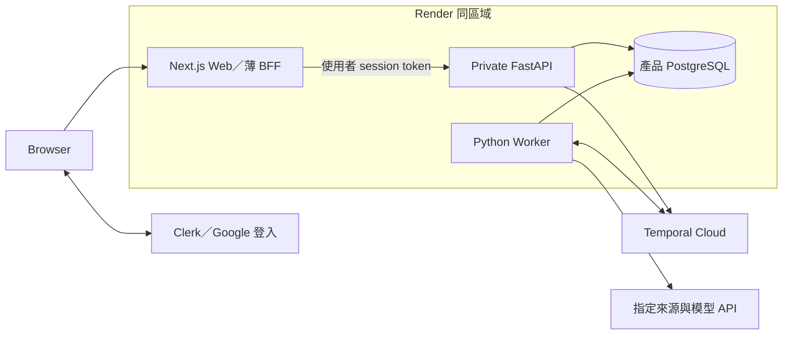

# Whisky Discovery Agent 技術架構

更新：2026-09-28。**已確定採 PydanticAI＋Python 後端＋Temporal**：使用者先選第三條執行路線，再確認 PydanticAI。Temporal 管理研究任務生命週期；部署、身分及其他配套仍是建議，尚未建立應用。產品行為見 [PRODUCT_SPEC.md](PRODUCT_SPEC.md)，本文件負責決策、邊界及驗證，不另存進度。

## 已確定與待選項

| 項目 | 狀態 |
|---|---|
| Agent framework＋持久化 workflow | 第一版需求；已選 Temporal 路線。 |
| 執行權威 | Temporal 管工作派送、等待、重試及恢復；Agent framework 管模型與工具協調。 |
| 產品範圍 | 個人探索計畫、可交辦研究，沿用雙入口、六項基礎能力、小型 reviewed catalog、台灣參考價格及可靠記憶。 |
| Agent framework | 已選 PydanticAI＋Python 後端，使用官方 Temporal 整合；Mastra TypeScript 留作替代紀錄。 |
| Web／產品保存 | 配套提案：Next.js、FastAPI、Clerk、PostgreSQL＋SQLAlchemy／psycopg／Alembic；尚待核定。 |
| 託管 | 配套提案：Render 承載 Web／API／worker／產品 DB，Temporal Cloud 管 workflow；費用與恢復目標見下文。 |
| 既有技術 | ADK、AG-UI、LangGraph、Agent Server 及全 TypeScript 都不是限制；舊版只有文件，沒有應用歷史要相容遷移。 |
| 後續功能 | 定期追蹤、通知及自動發布仍未納入 MVP。 |

## 執行路線的決策

| 選項 | 收益與代價 | 本輪處理 |
|---|---|---|
| LangGraph＋原生 Agent Server | 同一體系整合 graph、queue、checkpoint 與串流，整合邊界少；執行依賴該 runtime。 | 前版建議；使用者本輪選擇第三條，改為歷史替代方案。 |
| **Agent framework＋Temporal** | Agent 推理與通用持久工作分工；需維護 worker、產品 API 整合及 replay 相容性。 | **已選定**。Temporal 是唯一工作生命週期管理者。 |
| Library＋checkpointer，自行補 runtime | 部署控制力高；還要處理派送、worker 與恢復機制。 | 不選，不自建通用 runner／queue／checkpoint 平台。 |

原生 runtime 的整合優勢仍成立，選 Temporal 不代表前者無法做到。本輪依使用者明確選擇建立獨立執行層；沒有跨系統長交易不是排除 Temporal 的理由。也不代填使用者未說的學習或商業動機。

基準能力見 [Agent Server](https://docs.langchain.com/langsmith/agent-server)；Temporal 的執行程序見 [Workers](https://docs.temporal.io/develop/python/workers)。選 Temporal 不等於已選 Temporal Cloud，亦不代表 Cloud 會替產品部署自己的 worker。

## Temporal 路線中的 Agent framework

| 選項 | 整合方式與取捨 | 建議 |
|---|---|---|
| **PydanticAI＋Temporal** | 官方把 Agent 協調放在 workflow，模型／工具 I/O 放在 activities；代價是 Python 後端與 TypeScript Web 的契約及工具鏈。 | **已選定**，符合逐次模型／工具呼叫的恢復需求。 |
| Mastra＋Temporal | 官方將 workflow／step 映射為 Temporal workflow／activity；能維持全 TypeScript。 | 若語言統一優先則選；需驗證 step 內 Agent I/O、等待與取消的實際恢復粒度。 |
| LangGraph＋Temporal | 可使用圖建模，但必須明確安排 replay、等待及重試的權威，避免兩套狀態機各自恢復同一任務。 | 沒有必須沿用既有 graph 的限制，目前不優先。 |

[PydanticAI 官方整合](https://pydantic.dev/docs/ai/capabilities/durable_execution/temporal/) 現用 `TemporalDurability`；舊 `TemporalAgent` wrapper 已 deprecated。能力必須在 Temporal workflow 中執行才具持久性，直接從 HTTP endpoint 呼叫 agent 仍是普通執行。

[Mastra 官方整合](https://mastra.ai/integrations/deploy/temporal) 證實 step 對應 activity；不能據此推論 step 內每次模型／工具呼叫都已有獨立恢復點，也不能把文件沒有展示的功能判為不支援。框架比較是本案工程判斷，不是普及率排名。

## 配套選型的前提與替代

真實限制是 Python Agent 後端、Temporal、可跨裝置找回探索紀錄、小型人工覆核 catalog，以及個人維護。TypeScript 全棧、特定雲、既有資料遷移、微服務與本機保存都不是限制。預算尚未指定，本提案先以可靠保存、低維運負擔為目標；不是付費或部署授權。

| 業界常見組合 | 收益與代價 | 本案建議 |
|---|---|---|
| BaaS 整合 Auth＋DB，例如 Supabase | 登入與資料服務集中；若主要用 browser Data API／RLS 很直接。本案仍需 Python API／worker，而 Pro 預設每日備份，PITR 是額外費用。 | 保留替代，不因套件多就認定較完整。 |
| **託管應用／PostgreSQL＋獨立 Auth＋Temporal Cloud** | 常駐程序、DB 備份、登入及 workflow 各交給託管服務；代價是身分驗證與服務邊界須自己整合。 | **首選 Render＋Clerk＋Temporal Cloud**，符合已需要後端與 worker 的情境。 |
| AWS／GCP 等雲端元件，或自行架設 VM／Kubernetes | 網路、容量及部署控制較完整；需負擔更多基礎設施、升級與還原操作。 | 有組織既有平台、特殊網路或規模要求時再選；目前沒有這些限制。 |

這是依本案約束做的工程判斷，不是市場普及率排名。即使移除成本限制，也建議先維持同一套模組化後端、託管身分與資料庫；額外預算先投入還原演練與可用性，而非增加服務數量。

Web 重新比較 **Vite／React SPA** 與 **Next.js**：前者省掉 Node server，直接呼叫公開 Python API；後者多一個程序與轉接，但集中路由、登入及同源 BFF，Python API 可留在私網。本提案選 Next.js 是為了這個邊界，沒有把 SEO 或 SSR 當成已確認需求。FastAPI 適合 typed API 與 PydanticAI 共用 Python 契約；Django 在內建後台、表單及 ORM 整合優先時更有吸引力，目前沒有這項優先順序。

## 建議配套與專案結構

以下整套配套均為 **待核定提案**；已確定的仍只有 PydanticAI＋Python＋Temporal。先確認架構邊界，骨架再鎖定通過相容性驗證的穩定版本。

| 層 | 建議 | 責任 |
|---|---|---|
| Web | Next.js＋React＋TypeScript | 探索畫面、帳號互動與薄 BFF；不執行長研究。 |
| 產品 API | FastAPI＋Pydantic | 授權、commands、查詢、公開 view；提供 OpenAPI 契約。 |
| Agent／Worker | PydanticAI＋Temporal Python SDK | workflow 協調、Agent、activities；與 API 共用 Python domain/use cases。 |
| 產品 DB | Render PostgreSQL＋SQLAlchemy 2＋psycopg 3＋Alembic | Python 後端唯一管理 schema／migrations；runtime 與 migration 採同一 driver 家族。 |
| 身分 | Clerk；第一個登入方式為 Google | Next.js 與 Python 使用官方 SDK；FastAPI 獨立驗 token 及 owner，不自製密碼或 token 系統。 |
| 契約 | Pydantic／OpenAPI → openapi-typescript＋openapi-fetch | 產生 Web types/client；CI 驗證 schema、生成差異及 TypeScript，業務規則只在後端。 |
| 驗證 | pytest、Temporal test environment／replay、真 PostgreSQL、Playwright、固定 eval | 分開驗 domain、持久工作、產品資料及使用者旅程。 |
| 部署 | Render Web／private API／background worker＋Temporal Cloud | API／worker 共用後端映像及 domain，以不同 entrypoint 啟動；不按品牌、價格或會員拆微服務。 |
| 工具鏈 | pnpm 管 Web，uv 管 Python；各自 lockfile | 單一 repo、兩套明確工具鏈；先不加入 Nx／Turborepo 或自建套件發布平台。 |

配套文件：[Next.js self-hosting](https://nextjs.org/docs/app/guides/self-hosting)、[FastAPI](https://fastapi.tiangolo.com/features/)、[SQLAlchemy psycopg 同步／非同步支援](https://docs.sqlalchemy.org/en/20/dialects/postgresql.html#module-sqlalchemy.dialects.postgresql.psycopg)、[Alembic](https://alembic.sqlalchemy.org/en/latest/)、[OpenAPI client](https://openapi-ts.dev/openapi-fetch/)。產品 domain 由 Python 後端擁有，Web 使用公開契約；未來若改 Agent framework 須另行重評，不並存兩套 domain。



```text
apps/web/                 # Next.js
backend/
  src/whisky/
    api/                  # HTTP、auth adapter、commands、views
    workflows/            # deterministic orchestration、Update／Query
    agents/               # PydanticAI agent、prompts、typed output
    activities/           # I/O 與 framework integration
    domain/               # catalog／discovery／plans／memory 規則與型別
    application/          # 共用 use cases、交易邊界、必要的 I/O ports
    adapters/             # DB、來源、身分、Temporal client
  migrations/             # 單一產品 schema migration authority
  tests/                  # unit、integration、replay、recovery、evals
contracts/                # generated OpenAPI／Web client，非第二份手寫 SSOT
data/catalog/             # 人工覆核的來源資料與發布版本
tests/e2e/                # Web 旅程
```

Domain 不 import FastAPI、PydanticAI、Temporal 或 ORM；活動與 API 都呼叫同一批 use cases。自然語言與點選採相同 command 語意。只在實際外部依賴設 ports，不為每張表建立空轉的 interface／repository 層。runtime／依賴的相容版本在骨架鎖定，現在不提供不存在的執行命令。

## 身分、API 與資料存取契約

### 登入與授權

1. Clerk 負責 Google OAuth 與 session；Next.js 採官方 SDK。BFF 只轉接允許的產品 endpoints，驗登入與寫入請求的 Origin／CSRF 邊界，不接受任意 upstream URL。
2. BFF 將該使用者的短效 session token 傳給 FastAPI。Python 以官方 SDK 驗簽、固定可信 issuer／key 來源、token 類型、期限與 `authorized_parties`；若 API 配置 audience，發行與驗證兩端一起核定。只解碼 JWT 或相信 `X-User-Id` 都不構成驗證。
3. 由已驗證的 `(issuer, subject)` 對應內部 `user_id`，首次登入可交易式建立，避免依賴 webhook 到達順序。不用 email 當 owner，也不把 Clerk ID 散布成所有業務主鍵。
4. FastAPI 每次驗 app actor 是否有效，再以 owner scope 執行 use case；private network 不取代授權。讀報告、回覆補充、匯出、刪除同樣需要 owner 檢查；不存在與無權存取避免洩漏他人的物件資訊。
5. Worker 接收內部 actor／task ID，執行寫入時重驗資格；Temporal history 不保存 session／refresh token。使用者關頁或 session 到期不會中止已交辦工作，取消與刪除依產品狀態控制。
6. 本機 JWT 驗證不代表即時得知 Auth provider 的撤銷。應用停用／刪除先關閉 actor 與寫入資格；需要立即撤銷的身分操作使用 provider 查核或經驗簽的生命週期同步，測試其延遲，不宣稱本機驗簽已提供即時撤銷。

官方依據：[Clerk token 驗證](https://clerk.com/docs/guides/sessions/manual-jwt-verification)、[Clerk Python SDK](https://github.com/clerk/clerk-sdk-python)。沿用官方 session 行為，不另外簽發一套平行 JWT。

### 跨語言與連線

FastAPI 的 Pydantic request／response schema 產生 OpenAPI，Web 由此生成型別；生成型別提供編譯期檢查，不冒充 runtime validation。API 驗 request 及公開 response，拒絕不允許欄位；前端只做輸入提示，不重寫 eligibility、owner 或價格規則。共用錯誤格式含穩定 code、request ID、可重試性，command 的去重與 revision 語意沿用本文件。

BFF 不查 DB、不組織 Agent，不讓 browser 直接寫產品表。帳號資料回應與 session 依賴頁不進共享 CDN／ISR cache；進度頁重連查 snapshot，不靠 Node 程序內記憶保存任務。

應用表只經 Python 資料存取層，API／worker 使用受限 runtime DB role，migration 使用分開的 DDL role。Owner scope 與跨表關聯由 use cases／query 和約束保護，跨帳號整合測試驗證；本提案不宣稱 ORM 自帶 RLS。將來若開放 browser Data API 或其他獨立資料入口，須先重新設計 DB 層授權。

API／worker 使用 Render 的 internal DB endpoint，各自有一個有上限的 SQLAlchemy pool；psycopg 3 同時服務 async runtime 與同步 Alembic，不靠替換 hostname 或猜測 SSL query 參數轉換 DSN。使用 checkout 存活檢查；pool 預算計入程序、replicas、部署重疊及 migration，連線故障的交易重試仍需冪等。沒有量測證據前，不加入定時 `SELECT 1` 保活或第二層 driver pool。

## 部署、備份與成本提案

### 部署邊界

Render 同一個專用 workspace／區域放 Next.js public Web、FastAPI private service、常駐 Temporal background worker 及付費 PostgreSQL。API／worker 是同一個後端版本，依職責分程序，Temporal Cloud 另管 service；不使用 Render Workflows 建第二套排程權威。

區域建議 Singapore，Render 與 Temporal Cloud 均有對應區域；這不代表 Clerk 或模型服務的資料也限於該區。Render 私網以同 workspace／region 為邊界，Hobby 沒有進階環境網路隔離，故不把其他作品放進同一信任區。[Render 區域](https://render.com/docs/regions)、[私網邊界](https://render.com/docs/private-network)、[Temporal 區域](https://docs.temporal.io/evaluate/cloud/regions)

API／worker 同 repo、同 domain、同產品 DB；此處是部署角色拆分。Secrets 由託管環境注入，Web 不持有 DB、模型或 Temporal 密鑰。建立服務、網域、登入設定與 secrets 配置屬實作部署階段，不是本次已完成工作。

本機／CI 使用隔離 PostgreSQL、Temporal 開發／測試環境及受控 auth fixtures；另以獨立測試帳號驗真正登入。依賴鎖版、OpenAPI 生成、lint／typecheck、領域與整合測試、history replay 通過後才部署。Migration 以單次 release job 執行，採相容擴充→部署→清理，不在每個 replica 啟動時競跑；等待中的舊 workflow 依前述 worker version 策略保留 executor。

### 恢復目標

正式保存使用付費 DB，先提議 **RPO ≤15 分鐘、RTO ≤4 小時**，分別指可容忍資料遺失時間與恢復服務時間；這是待核定、待演練的目標，不是平台保證。Render 付費 PostgreSQL 在 Hobby workspace 有 3 天 PITR 視窗，Pro 以上為 7 天；不能還原最近 10 分鐘內的時間點，需實測最新可還原時間及整體切換時間。[官方備份文件](https://render.com/docs/postgresql-backups)

還原先停新 commands、私人資料讀寫與相關 worker，到新 instance 驗 owner／catalog／artifacts；依下述獨立於產品 DB 的 control receipts，重套恢復窗口中的撤銷／刪除，再對帳存活 workflows。Temporal 已記錄完成的 activity 不會因 DB 倒退而自動重寫；缺失結果須明示需恢復／重新研究，無法確認資格的工作撤銷寫入，另建新 task 才能重新研究。receipts 不完整或對帳未完成時不開放相關資料。演練包含這種跨系統狀態差異，不把 PITR 等同 HA 或零資料損失。

### 每月費用估算

以下以 **2026-09-28 官方公開價、USD、單一小流量環境** 試算，不含稅、網域、模型、額外流量／build、獨立 staging、還原臨時 instance 或雙版本 worker 重疊費。規格是容量估算起點，須以首個垂直流程的 RSS、並行與延遲量測調整。

| 項目 | 試算起點 | 月費 |
|---|---|---:|
| Next.js Web | 0.5 CPU／512 MB | $7 |
| FastAPI private service | 0.5 CPU／512 MB | $7 |
| Python Temporal worker | 1 CPU／2 GB | $25 |
| PostgreSQL | 0.5 CPU／1 GB，另配 5 GB storage | $19＋$1.50 |
| Render workspace | Hobby | $0 |
| Clerk | Hobby，含 Google 登入；使用量／功能在該方案限額內 | $0 |
| **固定計算小計** | 尚未包含下列 Temporal 用量 | **$59.50／月** |

來源：[Render 價格](https://render.com/pricing)、[compute plan 對照](https://render.com/docs/compute-plans)、[Clerk 價格](https://clerk.com/pricing)。Clerk 目前 Hobby 為每 app 50,000 MRU 限額，不把 MRU 寫成 MAU；若需去品牌、MFA 等方案外功能另估。

Temporal Cloud 目前沒有固定月費；actions 以 $50／百萬起、active history $0.042／GB-hour、retained history $0.00105／GB-hour，Developer support 為 usage 的 10%。例如**假設**每月 100,000 actions、平均 active 0.1 GB、retained 1 GB、730 小時，估算為 `(5＋0.1×730×0.042＋1×730×0.00105)×1.1 ≈ $9.72`；加上上述小計約 **$69.22**。這是算式示例，不是實測預測或費用上限，亦未用限期試用金抵扣。[Temporal 價格](https://temporal.io/pricing)

Supabase Pro 的 Auth＋DB 從 $25／月起、含每日備份；若需要 PITR，add-on 從 $100／月起，還須核對相容 compute 規格。這項恢復成本與既有 Python 邊界，使本案偏向 Render PostgreSQL＋Clerk。[Supabase 價格](https://supabase.com/pricing)

需要壓低預算時，先實測縮小 compute 或改 Vite SPA；schema、授權、去重及恢復契約維持一致。

## 資料與執行權威

| 狀態 | 權威來源 | 邊界 |
|---|---|---|
| 帳號、偏好、收藏、探索計畫、證據及報告 | 產品 PostgreSQL | 可匯出及刪除；模型上下文按需組成。 |
| 執行位置、等待、timer、activity 結果與重試 | Temporal Event History | 由 SDK 重播恢復；不是偏好或報告的長期資料庫。 |
| 畫面及進度 | API view／帶時間的投影 | 重連重新查任務及結果；token stream 不是唯一結果。 |

計畫有 `planId` 與研究條件 revision；更改目標／偏好／限制才推進，新增進度不使自己的研究失效。每個研究 `taskId` 對應穩定 `workflowId`，另記 runtime `runId` 供診斷；身分與授權不能依賴 ID 保密。

一次探索計畫可包含多個有界研究 workflow，不建立永不結束的使用者 workflow。每次工作限制工具次數、模型用量、history 大小及執行期限，另設帳號與整體並行／用量上限；等待回覆的期限與 activity timeout 分開。

## Temporal 執行契約

### 接受、去重與資料庫邊界

以下描述建立研究；取消、刪除及條件變更另依 control command 契約保存可跨 DB 還原的依據。

1. API 從受信任登入取得 actor，驗 owner、條件 revision 及允許的 command；client 不可選任意 workflow type、queue 或 tool config。
2. 產品 DB 以 command key＋payload hash 去重，建立唯一 task 及 workflow ID；同 key 不同 payload 拒絕。API 按同一 ID start，明確設定正在執行與已完成 ID 的衝突／重用政策；新研究才產生新 task。
3. Temporal service 確認接受，或同 ID 查回已存在，才顯示工作已接受。API 回應遺失時對帳既有 ID；不可為一次 HTTP retry 建立第二份工作。workflow 已完成則回傳原結果。
4. 產品 DB 寫入與 Temporal start 不是分散式交易。未確認接受保持待確認，重送或對帳沿用原 task；不使用「DB 有一列」冒充已入列，也不另寫通用 scheduler。
5. 完成報告的 DB transaction 驗 owner、task generation、研究條件 revision 及取消／被取代資格；以 artifact key 去重。DB 已 commit 但 activity completion 未記錄時，重試返回既有 artifact。

### Workflow 與 activities

Workflow 只做可重播的協調。模型、來源 HTTP、DB、檔案及其他 I/O 由 activities 執行；使用 framework 的官方整合，不把整個長研究 Agent loop 塞進單一 activity，也不另寫通用模型工具迴圈。

PydanticAI 的 `TemporalDurability` 負責其模型及工具 activities；產品 DB、來源與報告仍走明確 use cases。不能將其 durable agent 再包進外層普通 activity，丟失預期的呼叫粒度。

已記錄的 activity 結果可供 replay；尚未記錄 completion 的外部呼叫可能再執行。資料寫入使用業務唯一鍵與交易，不承諾所有 I/O exactly-once。設定 activity timeout、有限 retries、不可重試錯誤及整體研究預算，避免 SDK retries 與 Temporal retries 相乘。

### 人為等待與補充

Agent 回傳 typed 的「需要補充」結果後，workflow 保存 `clarificationId`、等待版本、問題與已完成研究引用，透過 durable wait 等待。問題呈現後不保持一個等待數天的 activity，也不持續呼叫模型。

補充採 Temporal **Update**：API 先驗 owner，command 帶 clarification ID、等待版本、條件 revision、idempotency key；workflow validator／handler 驗狀態，接受後保存答覆並解除等待。重送使用相同 Update ID／command，取回相同接受結果；舊答覆不可套到下一個問題。若所選 SDK 的去重範圍不足，須以 workflow 內 command receipt 補上業務去重，不能假定跨 run 自動保證。

Update 的答覆只表示補充已處理，不等於研究完成。短 HTTP timeout 後顯示待確認並對帳，不重新提問。Query 僅供讀取公開狀態；worker 不可用時可能無法服務 Query，API 應回可辨識的暫不可用或帶時間的投影。Signal 適合不需要即時業務回覆的控制訊息，server 接受 Signal 不代表 workflow 已處理。[訊息語意](https://docs.temporal.io/develop/python/workflows/message-passing)

補充後以新的 activity 重新讀目前 catalog／價格資格，保存前再驗當下條件；不能把等待前已記錄、replay 取回的舊查詢結果當成新查核。研究證據仍可留作歷史。

### 取消、條件變更與版本

取消、刪除及使舊任務失效的條件變更，建議由一種 typed `ControlCommand` workflow 保存最小 receipt，再透過 activities 執行產品交易。這利用已選 Temporal，不另設審計資料庫；相較外部 append-only log，少一套服務，但 receipt 的保留與列舉必須納入恢復驗收。

API 驗 owner／允許操作後，將目標 instance ID、generation／revision、操作及去重鍵交給 Temporal。Receipt workflow ID 依 scope、目標 instance、identity generation 與操作類型決定；條件變更另以預期 revision 定位，command key／payload hash 處理重送與衝突。先有 durable receipt 才修改產品 DB；先記錄 validation 結果，再由 effect activity 在交易內重驗前提、撤銷 fence／套用刪除，最後通知研究 workflow 取消。HTTP 在確認 Temporal 接受後只可顯示「已提出」，DB effect 確認後才顯示相應操作完成；失敗或無法確認不得顯示成功。一般未涉及撤銷的 CRUD 不因此全改為 workflow。

Receipt 不含被刪原文或 token，記錄操作的 validation／effect 結果與目標版本；identity generation 與可修改的 revision 分開，重新收藏建立新 instance，避免舊刪除誤傷新項目。retention 覆蓋**所有可還原產品備份期限＋緩衝**，且不與使用者內容 history 一起提早清除；規劃起點為備份最長 7 天、receipt 30 天，實際 namespace 設定與清除流程須驗證。這份有限期的最小紀錄用途與保存期需列入刪除說明。

PITR 對帳的預期集合由**還原資料中的 target instance／generation 及其 owner／plan 等上層 scope** 決定，依固定 ID 逐一查回 receipt；不能只靠 workflow 搜尋清單或建立時間篩選自證完整。必須納入還原點之前已接受、之後才生效的 command，以及 pending／回應不明者。有效且已完成的效果重套到相符 instance；明確拒絕的不套用，未確認者保持隔離並恢復處理。在保留契約成立時才能將確定的 NotFound 當作無該 command；查核錯誤、保留期不符或證據缺失均不得開放相關資料。

驗收注入「receipt 已接受、DB commit 完成、通知研究 workflow 前中斷，再還原至 DB commit 前」，也測早已接受但延後生效、重新收藏、搜尋漏列、receipt 過期及缺漏。還原後另外核對存活研究工作；找不到產品 task 或無法確認資格者先撤銷寫入。此為待實測的恢復契約，不把文件審查視為恢復測試通過。

取消／刪除先在產品 DB 撤銷寫入資格，再要求 Temporal 取消。外部 activity 可能來不及停止，晚到結果仍須被 transaction 擋下；取消是協作式，不能只憑 API 已送出宣稱外部 I/O 已停止。

計畫研究條件變更時，交易推進 revision、標舊未完成 task「已被取代」並關閉寫入，再通知 workflow 停止及關閉待補問題；完成報告保留為歷史。使用者選擇依新條件研究才另建 task，不暗中改寫原 workflow 輸入。

workflow／activity／tool 名稱、payload schema、model／prompt／policy／catalog 版本均可追溯。部署要跑舊 history 的 replay；不相容變更用版本化 worker 或 SDK patching，等待中的舊工作有明確可用 executor。具體 Worker Versioning 設定在骨架驗證，不能只測新 workflow。[安全部署](https://docs.temporal.io/develop/safe-deployments)

## 研究、UI 與資料治理

Agent 只能查 reviewed 庫、讀指定來源、比對版本、提出問題及整理引用；不能自行放寬硬限制、改已確認偏好或發布正式 catalog。外部頁面是資料，reader 限允許的 HTTPS 來源、redirect、大小／時間及網路目的地，阻擋私有網路及任意 URL。

研究觀察、模型整理、證據與覆核狀態分開保存；待覆核資訊可明示於報告，正式推薦／嚴格預算只使用 reviewed 資料。catalog 由 Git 中覆核資料發布為不可變版本；用戶補充不等於編輯者覆核。

Web 經產品 API 讀任務 snapshot，顯示等待執行／研究中／需要補充／完成／失敗／已取消／已被取代。第一個骨架以狀態查詢證明完整流程；即時串流再依所選 framework 官方 durable backend 整合驗證。AG-UI 或 AI SDK UI 不擁有工作生命週期，不能為了串流直接從 HTTP 執行普通 agent。

Browser 不持有 Temporal／模型憑證，也不能直接 Query 任意 workflow。內部 history、工具原文及隱藏推理不公開，卡片 facts 驗證並保存後才顯示。進度通知可以重送或缺漏，公開結果以產品 DB 為準。

刪除涵蓋產品 DB、相關 Temporal 執行歷史／payload、traces 與備份保留政策；使用最小必要 payload，不把秘密或不必要的完整個資放進 history。匯出不能替代備份；產品 DB 的 PITR／RPO／RTO 目標與 Temporal service 的 retention／恢復條件分開驗證。

Logs 記 task／workflow／run／revision、階段、latency、用量與錯誤分類；模型輸入輸出預設遮罩或不記。執行所需 history 與可選 debug traces 分開治理，兩者的保留／刪除均需驗證。

## 第一個交付與驗收出口

第一個垂直流程是「委託研究 → 真實來源 → 等待補充 → 關頁 → 登入回覆 → 繼續研究 → 保存報告」。以隔離 fixtures 控制故障，實際模型／來源連接與 stub 分開記錄。

| 驗證 | 通過條件 |
|---|---|
| 產品規則 | 版本、硬限制、價格時效、未知值、引用及 reviewed 邊界正確。 |
| 接受與重送 | start 回應遺失後沿用原 workflow；完成的 task 不被 HTTP retry 重啟。 |
| 正常等待 | 換程序與瀏覽器仍可找到同一問題並接續；重送答覆不再注入，舊答覆不能進下一個等待。 |
| Worker crash | 執行中非正常中止後由新的 worker 恢復；已記錄工具結果不重做，未確認完成的 I/O 可重試但寫入不重複。 |
| DB／Temporal 邊界 | DB commit 後 activity completion 前中斷，恢復不產生第二份報告；取消、刪除及條件改版擋晚到結果。 |
| 部署相容 | 舊版本等待中的 history 可在受控版本恢復，replay tests 有辨別力。 |
| 身分與跨語言契約 | 不同帳號不可讀／回覆；Web client 符合實際 API schema，模型不能擴張授權範圍。 |
| 真實登入與失效 | Google 登入到 API 的 issuer／key／azp 設定正確；過期／錯誤來源 token、停用 actor 及跨帳號 IDs 均拒絕；不靠 webhook 順序建立帳號。 |
| API 與資料部署 | BFF 到 private API／DB 連線可用；個人資料不被共享快取；單次 migration、pool 上限及新舊 worker 重疊經驗證。 |
| 營運 | worker、Temporal service、產品 DB 各自故障可診斷；恢復、刪除與費用有實測紀錄。 |

模型使用同一組繁中需求理解、版本消歧、工具選擇、來源衝突及修改案例比較品質／延遲／成本。下一個決策是核定本文件的配套、預算與恢復目標，再以垂直流程選出相容版本及模型；不逐套重新詢問純實作細節，也不能以只裝套件或模型回一句話宣告架構成立。交付相依見 [PRODUCT_SPEC](PRODUCT_SPEC.md#開發順序與完成界線)。
