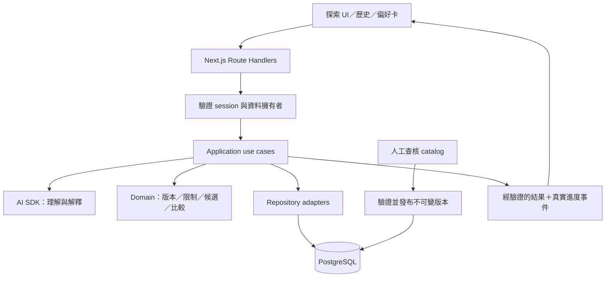

# Whisky Discovery Agent 技術架構提案

更新：2026-09-28。狀態：供開發前評估的建議方案，尚未核定整套技術、安裝依賴或實作。產品需求以 [PRODUCT_SPEC.md](PRODUCT_SPEC.md) 為準，本文件負責技術選型、責任邊界與工程驗收，不另存開發進度。

## 建議結論與前提

建議採 **Next.js App Router＋TypeScript、AI SDK、PostgreSQL 的模組化單體**。一個 Node 應用提供 UI、API 與受控的 LLM workflow；資料庫保存使用者與探索資料。以成熟 SDK 呼叫模型及傳輸串流，業務規則維持獨立，無須建立通用 Agent 執行框架。

「最好」在此指能驗證正確性、恢復資料、控制成本並容易修改；無法承諾永遠沒有技術債。下列選擇是目前需求下的工程判斷，不是宣稱所有業界產品都採同一套 stack。

| 前提 | 性質與本次處理 |
|---|---|
| 雙入口、六項功能、真實小型 catalog、台灣參考價格 | 已確認需求；維持產品範圍。 |
| 能記得過去探索，以紀錄可靠、可長期使用優先 | 已確認的新優先序；使用者允許重新評估原本的本機保存。 |
| 還未上線 | 可重新選型。以 `git ls-files` 核對現況只有文件與 `.gitignore`，沒有應用程式或既有使用者資料需要相容遷移。 |
| ADK TypeScript、AG-UI、Vite、localStorage | 舊方向，均不是本次必須保留的限制。 |
| 展示 Agent 能力 | 必須呈現需求理解、能力呼叫、狀態修正與證據；不等同必須多 Agent 或自主規劃。 |
| 大流量、原生手機 App、離線編輯、長時間背景任務 | 尚無這些需求；不據此增加基礎設施。 |

若維持舊限制，可用 ADK＋AG-UI 配合獨立推薦規則，但仍須補持久化、授權與整合驗證；localStorage 單獨無法提供清除瀏覽器後的帳號恢復。解除限制後，建議縮小執行抽象、改用伺服器保存，將工程投入放在資料與行為保證。

## 選型的範圍與取捨

### LLM 執行方式

| 選項 | 適用情境與代價 | 本案判斷 |
|---|---|---|
| 純規則與表單 | 可預測、易測試；自然語言理解與互動彈性有限。 | 作為推薦核心與模型失敗時的可用操作，不足以獨自完成展示目標。 |
| 應用控制流程＋LLM SDK | 程式決定步驟，模型處理理解、釐清與表達；應用仍須負責狀態、保存與失敗處理。 | **建議**。本案主要流程已知，採 AI SDK 的結構化輸出與 UI 串流能力。 |
| Agent framework，如 ADK、PydanticAI、LangGraph | 提供工具、執行或狀態抽象，適合需要較複雜編排的產品；須理解框架生命週期與除錯方式。各框架能力不同，並非都要求自主執行。 | 保留為候選；目前沒有需求足以抵銷新增抽象與整合成本。 |
| 可持久恢復的 workflow | 適合跨重啟繼續工作、長時間等待或人工審批；須處理 checkpoint、重試與外部副作用。 | 本輪不需要。保存探索紀錄與恢復一個正在執行的任務是兩種需求。 |

Anthropic 的 [Building effective agents](https://www.anthropic.com/engineering/building-effective-agents) 區分程式指定路徑的 workflow 與模型決定路徑的 agent，建議從能解決問題的簡單組合開始。該文發表於 2024 年，這裡引用架構原則，不用它判定今日套件排名。[AI SDK workflows](https://ai-sdk.dev/docs/agents/workflows) 支援應用控制的組合；[LangGraph](https://docs.langchain.com/oss/javascript/langgraph/overview) 則明確聚焦有狀態、長時間執行與持久化編排。

### Web、身分與儲存

| 決策 | 主要選項與代價 | 本案建議 |
|---|---|---|
| Web 應用 | Next.js 整合頁面、API、伺服器邊界，但要理解其快取與部署語意；React＋Vite＋Hono 組合較顯式，但路由、API 與整合約定需自行決定；React Router framework 也是合理選項。 | Next.js App Router。理由是統一這個有帳號、歷史與 API 的 Web 產品，不是為了本案尚未要求的 SEO。 |
| 語言與服務邊界 | 全 TypeScript 共用型別與開發工具；Python＋FastAPI／PydanticAI 適合 Python 資料、ML 或既有 Python 團隊，但前後端契約與部署分工更多。 | 全 TypeScript、單一 repo、單一可部署應用；不先拆 Python 服務。 |
| 長期保存 | 瀏覽器保存簡單且可離線，但身分、跨裝置恢復與備份弱；伺服器資料庫增加營運成本，能集中處理權限、交易與備份。 | PostgreSQL 為使用者資料的權威來源；瀏覽器只保存可丟棄的草稿與畫面狀態。 |
| 身分管理 | Clerk／Supabase Auth 等託管服務減少維護負擔，增加外部服務與費用依賴；Better Auth 以套件整合自有應用及資料庫，需自行維護更新、設定與監控。 | Better Auth＋PostgreSQL，先採單一 Google OAuth 登入；使用穩定內部 user ID，不以 email 當擁有者鍵。這是完整建議，尚未配置 OAuth。 |
| DB 存取 | 直接 SQL 控制明確但需自行維護型別；Prisma 提供較多高階抽象；Drizzle 保留接近 SQL 的模型並提供 TypeScript schema。 | Drizzle＋可審閱、提交到 Git 的 SQL migrations；資料正確性仍靠交易與 DB constraints。 |
| 前後端串流 | 同一應用可用 AI SDK UI 的 typed data stream；AG-UI 適合需要跨 framework／backend 互通的場合，但多一層協定適配。 | AI SDK UI stream；本輪不加 AG-UI、不自訂通用串流協定。業務資料仍定義自己的 schema。 |

[React 官方文件](https://react.dev/learn/creating-a-react-app) 將 Next.js 與 React Router 列為 framework 選項；沒有「Vite 一定要兩次部署」的限制，[Hono 可提供靜態檔案](https://hono.dev/docs/getting-started/nodejs)，因此也能同服務提供 SPA。Next.js 可 [自行部署到 Node／Docker](https://nextjs.org/docs/app/guides/self-hosting)，不必綁定 Vercel。

身分整合依 [Better Auth Next.js](https://better-auth.com/docs/integrations/next) 與 [Drizzle adapter](https://better-auth.com/docs/adapters/drizzle)。選它是讓身分與產品資料維持在同一套應用／DB、方便移轉，代價是承擔 auth 套件與設定維護；若以減少這項維護為首要目標，託管身分服務是合理替代。不重寫自己的密碼或 token 系統。SQL 變更採 [Drizzle migrations](https://orm.drizzle.team/docs/migrations) 的 schema→SQL→執行路徑；[AG-UI](https://docs.ag-ui.com/introduction) 的跨 Agent／UI 協定能力保留給實際互通需求。

## 建議 stack 與部署單位

| 用途 | 選擇及邊界 |
|---|---|
| Runtime／工具 | Node.js 24 LTS、TypeScript strict、pnpm；在骨架實作時固定當時相容的 stable 套件版本、lockfile 與 runtime patch。 |
| UI／HTTP | Next.js App Router＋React；互動區為 Client Components，Route Handlers 是薄 HTTP adapter；讀寫都呼叫同一批 application use cases。 |
| 模型與串流 | AI SDK Core／UI＋Zod runtime schemas；由模型 adapter 集中設定 provider、prompt 與呼叫預算。 |
| 身分／DB | Better Auth、Drizzle、託管 PostgreSQL；單一應用資料庫，正式資料不與其他專案共用可寫 schema。 |
| 驗證 | Vitest 驗證 domain／application；真 PostgreSQL 驗證交易與權限；Playwright 驗證主要旅程；固定語料評估模型行為。 |
| 部署／觀測 | 可攜的 Node container＋託管 PostgreSQL；結構化 logs，必要時接 OpenTelemetry。先一個應用服務，不建微服務平台。 |

Node 版本依 [官方 release 狀態](https://nodejs.org/en/about/previous-releases) 選 LTS；這不是已安裝版本。模型不先按品牌指定：用同一批繁體中文需求、版本消歧、局部修改、證據解釋案例比較正確率、延遲與成本，選一個通過門檻的 provider／model。AI SDK 降低 API 差異，無法保證不同模型行為相同；換模型仍須重新 eval。

## 系統與模組邊界



- **Domain** 決定資料資格、預算、候選與比較，不 import Next.js、AI SDK 或 ORM。純函式可直接驗證日期、未知值與條件邊界。
- **Application** 執行探索、修正、收藏、回饋、保存與重開；決定交易、權限檢查與執行順序。自然語言及 UI 點選最後都進相同 command。
- **Adapters** 對接 DB、模型、HTTP、auth；只有這些外部邊界需要可替換契約。不為每個函式建立 interface／factory／通用 repository。
- **UI** 呈現 server view model，不從生成文字解析 ABV、價格或卡片。Next.js server/client import 邊界要有靜態檢查，domain 的禁用依賴也納入 CI。

建議目錄如下；這是待建立的結構，不是目前磁碟現況：

```text
src/
  app/                      # 頁面、薄 Route Handlers、auth endpoints
  features/                 # exploration、comparison、history 的 UI
  contracts/                # command、view、stream payload 的 runtime schemas
  modules/
    catalog/                # 版本、證據、價格；domain + application + repository
    discovery/              # 偏好修正、限制、候選、比較與探索 use cases
    memory/                 # 長期偏好、收藏、回饋與保存結果
  server/
    ai/                     # prompts、context、模型 adapter
    auth/                   # Better Auth 設定、server actor
    db/                     # connection、schema、transaction wiring
    composition/            # 將各 module 與外部 adapters 組起來
data/catalog/               # 人工整理的來源檔及查核狀態
drizzle/                    # 已提交的 SQL migrations
tests/                      # integration、e2e、evals；純規則測試可 colocate
```

每個 module 的查詢由自己的 repository 管理；`server/db` 不集中全部業務 SQL。跨模組走公開 use case／查詢介面，不直接存取另一模組的表；不建立跨專案共用的 Agent 平台。初期一個 package 足夠，尚無獨立發布單位需要 monorepo 工具。

## 一輪探索的執行契約

1. Server 從 session 取得 actor，驗證探索擁有者；接收 `explorationId`、`expectedRevision`、`idempotencyKey` 與本次操作，不接受 client 指定有效的 owner。
2. 以短交易登記本輪 run，保存要求及其預期版本。idempotency key 以 owner／操作範圍唯一，附 payload hash；相同 key、相同 payload 回傳既有狀態，相同 key、不同 payload 拒絕。
3. 自然語言透過 LLM 產生具 schema 的 intent／局部修改提案；點選直接產生同一 command。歧義先釐清，不以推測取代明確偏好，不將整份舊偏好覆蓋回去。
4. 應用驗證提案，只允許本次指定的欄位；以 `expectedRevision` 比對後，在同一交易提交新偏好版本與 run 的 `appliedRevision`。若基準已變，回報衝突並重新取得狀態，不悄悄套用過時提案。
5. Domain 使用指定 catalog release、價格政策版本與評估時間找候選；硬限制、來源資格與候選選取不由 LLM 自由改寫。
6. 將已驗證的 facts、reason codes 與 evidence IDs 交給模型組織說明。服務再驗證 schema、ID 關係與本輪版本；版本、價格和關鍵理由直接由結構資料呈現。
7. 以短交易再次檢查目前 revision、有效 run ID、run 仍在執行中且未超過 deadline，才保存推薦與終態；資料已刪除、run 已取消／中斷／被取代時不能晚到提交。新需求取代的 run 標為 superseded，不能成為目前結果。**DB commit 成功後**才送出完成結果或顯示已保存。

LLM 網路等待期間不保持 DB transaction 或長時間資料鎖。單輪呼叫次數、時間與 token 設上限；schema 失敗可做有界修正，不能無限重試。修改價格、資料或提示都能追到版本。

### 串流與故障語意

- 使用 [AI SDK typed data streaming](https://ai-sdk.dev/docs/ai-sdk-ui/streaming-data) 傳實際進度與具型別資料；`runId`、revision 與狀態屬應用 payload。SDK 解決傳輸，不代替權限與資料交易。
- 先送釐清／搜尋等進度；完整卡片的 facts 與引用驗證後才公開。第一版不逐 token 展示尚未驗證的酒款敘述。形式正確的引用也不保證解釋語意正確，仍須模型 eval 與人工抽查；失敗時退回已驗證的結構理由。
- 連線中斷後重新讀取 server run／結果。若結果已 commit，直接取回；若程序中止而未完成，依 run deadline 判定中斷，保留已存偏好，允許重試。相同 key 的傳輸重送讀回原 run；重做失敗工作則建立新 key／run 並引用前次 run。若已有 `appliedRevision`，從該版本重新生成，不能再次解讀並套用原 intent；目前偏好若已改變，明示改用新版本。偏好尚未提交才可重新處理修改。第一版不承諾原模型生成能自動從中間續跑。
- DB 寫入失敗不送成功；模型失敗不抹去已保存狀態。UI 可繼續瀏覽既有結果、用結構化偏好修改重試；服務故障時清楚標示哪些新操作尚未保存。
- API／UI 都比對 revision。清除或刪除資料也要處理正在執行的 run，避免晚到結果重新寫回已刪除紀錄。

## 記憶、身分與資料生命週期

### 保存什麼

| 資料 | 權威來源與用途 |
|---|---|
| 長期偏好 | 帳號下的明確偏好與來源回饋；推測另列待確認。本次預算不自動變永久限制。 |
| 探索狀態 | exploration、revision、當輪條件、run 狀態及候選；每次接續以 server 狀態為準。 |
| 收藏與品飲回饋 | owner＋酒款 ID＋狀態／原因；收藏不等於喝過，也不直接推導整組風味喜好。 |
| 探索歷史 | 當時的條件、選擇、取捨、替代項、catalog／政策版本與證據引用；與目前重新計算的結果分開。 |
| 對話與呈現 | 可保存有版本的 UI messages 以回看；不以整段聊天作為唯一偏好資料或無限塞回模型。 |
| 暫存與觀測 | 瀏覽器草稿可丟棄；logs／traces 用於診斷，不作使用者記憶資料庫。 |

新的模型請求只載入相關明確偏好、當次探索摘要與需要的證據。記得過往探索不需要保留舊 runner 或永不終止的 LLM session。AI SDK 的 [message persistence 文件](https://ai-sdk.dev/docs/ai-sdk-ui/chatbot-message-persistence) 提供訊息儲存機制，但帳號、業務狀態與可靠性仍由應用負責。

### 登入與恢復

建議第一版先登入再建立持久探索；未登入可瀏覽公開酒款與產品示例。相同 Google 身分從另一瀏覽器登入後可找回紀錄；不把匿名 cookie 當成可恢復帳號。OAuth 帳號本身的恢復依其提供者處理，不承諾無身分憑據的找回。

所有私有 read／write 都以 server actor 限定 owner，含讀取歷史、串流開始、匯出與刪除；不可只靠 UI 隱藏按鈕。auth library 處理 session 與 OAuth，應用負責資料授權。登出清除私有 client cache，私有頁面／API 不進共用快取。依框架及 auth library 的來源驗證機制防護寫入端點，保持同 origin；模型與 DB secrets 只留 server。

提供資料匯出、單筆刪除與帳號資料刪除；備份內資料依保留政策到期，還原時需重放備份時間之後的刪除紀錄，避免已刪除資料復活。正式使用前需把帳號停用／刪除與還原流程一起演練。

### Database 模型與 catalog 發布

使用一般 UUID 作實體 ID，revision 為遞增整數。ownership、外鍵、唯一性與查詢欄位採關聯欄位；具 schema 的不可變證據與歷史內容可使用 JSONB，不把全部產品狀態塞成一份自由 JSON。必要的 PK／FK／unique／check constraints 參考 [PostgreSQL 官方文件](https://www.postgresql.org/docs/current/ddl-constraints.html)。

概念資料群為 `users/accounts/sessions`、`catalog_releases/items/evidence/price_observations`、`explorations/revisions/runs/recommendations`、`preferences/favorites/tasting_feedback/saved_results`，實際表名在 schema 設計時確定。推薦紀錄保留 catalog release、policy version、evaluatedAt、偏好 revision、模型與 prompt 版本；可重算確定性篩選，但不宣稱能逐字重現模型輸出。

catalog 由 Git 中人工查核的資料發布為不可變 DB release。發布先驗 schema、來源、版本和查核狀態，再以 transaction 切換 current release；runtime 只讀已發布版本，使用者不能改寫 catalog。Git 是編輯來源，DB 是已發布的讀取來源，沒有雙向同步。保留歷史 release／證據供舊結論解析；停用推薦的酒款仍能顯示歷史，重新探索則重新檢查目前價格資格。

## 驗證、觀測與營運

| 層次 | 要驗證的行為 |
|---|---|
| Domain／資料驗證 | 版本匹配、來源資格、未知值、30／31 天價格邊界、多來源取價、保留條件與不湊候選；合成 fixtures 與真實資料隔離。 |
| PostgreSQL integration | owner 隔離、revision 競爭、同請求重送、刪除與晚到寫入、交易失敗；在真 PostgreSQL 測試，不能用另一種 DB 假定行為相同。 |
| Workflow／UI integration | 使用有明示的 model stub，驗證實際 use case 到 UI 的成功、釐清、衝突、中斷與重新讀取。stub 成功不等於模型品質通過。 |
| E2E | 新手／熟手旅程；登入、保存、關閉後重開及另一瀏覽器登入；舊結果不能冒充新條件，帳號間不可互讀。 |
| 模型 eval | 固定繁中案例＋人工可理解性檢查，量測 intent／局部修改／消歧／證據一致性及延遲成本。硬限制仍由程式測試判定，不交給另一個 LLM 打分後放行。 |
| CI | 型別、import 邊界、lint、相關 tests、catalog 驗證、正式 build；migrations 在空 DB 與前一版 schema 的代表資料各跑一次。 |

Logs 記 run ID、revision、模型／prompt 版本、latency、tokens、錯誤類型；預設不記原始對話或完整模型輸入輸出。若啟用 [AI SDK telemetry](https://ai-sdk.dev/docs/ai-sdk-core/telemetry)，明確關閉 input／output recording，不假設套件預設符合隱私目標。對話保存於有權限及刪除機制的產品資料中，與 telemetry 分開。

正式長期使用前選擇有自動備份與 PITR 的託管 DB，確認保留期間與還原權限；**還原到隔離資料庫並驗證紀錄可讀**才算恢復能力通過。建議初始目標為 RPO ≤15 分鐘（災難下最多損失的時間範圍）、RTO ≤4 小時（恢復服務時間），需由付費方案與演練支持，現階段不是承諾的 SLA。這是可靠性優先下的工程建議，部署選型需同時列出成本；不能因有每日備份就宣稱符合此目標。PITR 機制見 [PostgreSQL 文件](https://www.postgresql.org/docs/current/continuous-archiving.html)，匯出不能取代備份。

部署選能承載 Node 與持續串流的 host，先驗代理 buffering、request timeout、DB connection pool 與 graceful shutdown；Next.js [BFF 文件](https://nextjs.org/docs/app/guides/backend-for-frontend) 提醒部署平台可能限制 request 執行時間，不能把 HTTP handler 當背景工作系統。公開使用前設定單帳號請求／token 配額及總成本上限，從少量實際流量調整，不先引入 Redis。

部署同一版 application／catalog／policy 的對應關係要可追溯。程式與 catalog 可切回已驗證版本；DB 變更以可相容擴充或 forward fix 為主，不對已有使用者資料直接執行破壞性 down migration。

## 何時才增加複雜度

| 可觀察的新需求 | 到時重新評估 |
|---|---|
| 同一 backend 要服務不同 Agent UI／framework | AG-UI 或明確版本化的跨端協定。 |
| 跨重啟繼續長任務、人工等待、外部副作用重試 | LangGraph／workflow engine／worker，依實際恢復語意選型。 |
| catalog 與非結構化資料變大，現有搜尋品質不夠 | 先量測查詢，再評估全文或向量檢索；硬限制仍走結構化判定。 |
| 確有 Python ML 需求或獨立團隊／擴縮需求 | Python 服務或模組拆分，不為語言偏好先承擔服務邊界。 |
| DB 指標證明快取或跨 instance 配額是瓶頸 | 針對具體問題加 cache／Redis，不同時複製多份業務狀態。 |
| 使用者確實需要離線修改後同步 | local-first、衝突解決與同步協定；不把瀏覽器 cache 宣稱已具備。 |

## 第一個交付應證明什麼

將 [PRODUCT_SPEC 開發順序](PRODUCT_SPEC.md#開發順序與完成界線) 的第一階段做成最小垂直流程：登入 → 載入一小批 reviewed 真實資料 → 理解並修改一個條件 → 規則找候選 → 保存 → 重開找回 → 依目前資料重新評估。離線 fixture 驗證完整程式路徑，配置模型與 OAuth 後再驗證真實連接，兩者結果分開記錄。

骨架完成的證據應包含 migrations、owner 隔離、revision／重送處理、失敗後恢復與可重跑命令。第一階段只用最少 UI 證明架構，完整六功能、資料覆蓋與真人體驗在後續階段驗收；不以「SDK 能回一句話」宣告架構成立。

尚待實測的選擇是具體模型、相容套件版本，以及符合預算和恢復目標的部署／DB 方案；這些有明確驗證出口，不保留「之後再補安全、資料所有權或保存契約」的缺口。
